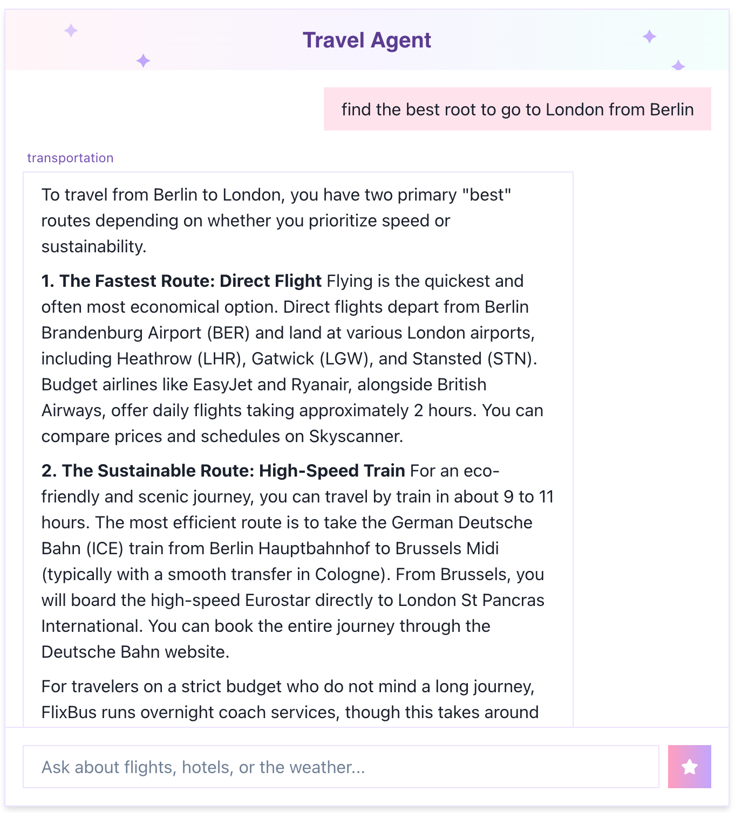
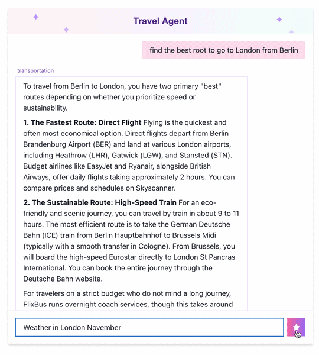

# Travel Agent Platform

AI-powered travel planning agent with production-realistic infrastructure.

## Demo





This is the chat UI running against the real backend, reached through `kubectl port-forward` — the app has no public endpoint (see `design.md` D2/D15).

### Current Architecture


Diagram source: [`docs/diagrams/architecture-current.mmd`](docs/diagrams/architecture-current.mmd).

### Planned Architecture (Steps 11–14)

This is the planned target state tracked by [`docs/plan.md`](docs/plan.md) Steps 11–14 — **not what's deployed today**. See the diagram above for the current, actually-deployed architecture.


Diagram source: [`docs/diagrams/architecture-planned.mmd`](docs/diagrams/architecture-planned.mmd).

## What This Repository Demonstrates

- **Zero long-lived cloud credentials** — CI authenticates to Azure via OIDC federation only, no stored secrets
- **Cost-conscious infrastructure** — the AKS cluster layer is destroyed after every work session; only the platform layer (registry, vault, identities) persists
- **No public network exposure** — the Gateway has no public IP, verified directly against the Load Balancer's actual IP allocation, not just by configuration intent
- **Fault-injection tested** — Key Vault access was deliberately revoked mid-session to confirm secret delivery actually depends on Workload Identity, then restored
- **Stateless resilience** — the backend pod was deleted mid-session and the service recovered with consistent answers
- **Evidence-driven process** — every verification claim is backed by an actual command's output or a screenshot, not by assertion alone

📖 [Read the full deployment case study](https://taliko5.github.io/travel-agent-platform/) — architecture decisions, trade-offs, and verification evidence from the AKS deployment.

## Stack

- **Backend:** Python, FastAPI, LangGraph, ChromaDB
- **LLM:** Google Gemini (`gemini-3.5-flash`, `gemini-embedding-001`)
- **Tools:** MCP servers — weather (live Open-Meteo), flights (mock), hotels (mock)
- **Infra:** Docker, Kubernetes, GitHub Actions
- **Testing/Quality:** pytest (backend), Vitest + React Testing Library (frontend), ruff (lint + format), ESLint + Prettier

## Running Locally

### 1. Backend (localhost:8000)

```bash
cd backend
python -m venv venv && source venv/bin/activate
pip install -r requirements.txt
cp .env.example .env                              # then set GOOGLE_API_KEY inside
python rag/ingest.py                              # one-time: load travel guides into ChromaDB
uvicorn api.main:app --reload --port 8000
```

Verify with `curl http://localhost:8000/health`.

### 2. Frontend (localhost:3000)

Requires **Node 24** (latest LTS). Check with `node -v`; if you're on an older system Node, use `nvm install 24 && nvm use 24` (a `.nvmrc` is included, so plain `nvm use` also works from `frontend/`).

```bash
cd frontend
nvm use                                            # picks up Node 24 via .nvmrc
cp .env.local.example .env.local                  # defaults to http://localhost:8000
npm install
npm run dev
```

Open `http://localhost:3000` — the backend must already be running for chat to work.

### Full stack via Docker (alternative to steps 1–2)

```bash
docker-compose up --build
docker-compose exec backend python rag/ingest.py   # first-time ingest
```

Starts both services together: backend on `:8000`, frontend on `:3000`. Requires `GOOGLE_API_KEY` set in `backend/.env` beforehand (docker-compose reads it via `env_file`). Stop with `docker-compose down`.

## Deploying to Azure (Step 9)

The app also runs on AKS (Azure Kubernetes Service), raised and torn down per working session rather than left running. **Before doing any of this, get the cost-approval go-ahead required by `openspec/changes/step9-aks-deployment/tasks.md` Section 7** — Section 8 there is the authoritative step ordering if anything below is ambiguous.

### 1. Raise the cluster

1. Apply the platform Terraform state (registry, Key Vault, CI/backend identities) — see `Infrastructure/terraform/platform/README.md` for the exact command and var flags.
2. Set the `GOOGLE_API_KEY` secret value directly in Key Vault, out-of-band (not via Terraform) — same README covers this.
3. Apply the cluster Terraform state (AKS cluster, node pool, Gateway) — see `Infrastructure/terraform/cluster/README.md`.
4. Re-apply the platform state a second time, now passing the new cluster's OIDC issuer URL — this is what wires the backend's federated identity to the cluster just created. Covered in the same platform README.
5. Deploy the Helm chart (`Infrastructure/helm/travel-agent/`), either by hand or via the CI pipeline's `push` job on a merge to `main`.

### 2. Rotate `GOOGLE_API_KEY`

`az keyvault secret set` updates the vault, the CSI mount, and the synced Kubernetes Secret automatically. It does **not** update a running container's environment — Kubernetes populates env vars from a Secret once, at container start, and does not hot-reload them. Rotation is not complete until the backend pod is restarted:

```bash
kubectl rollout restart deployment/travel-agent-backend
```

This restart is the step most likely to get forgotten, precisely because everything before it happens automatically.

### 3. Tear down

```bash
terraform destroy
```

Needs the same `-var` flags as the apply step — see `Infrastructure/terraform/cluster/README.md` for the exact invocation.

This destroys the **cluster** Terraform state only, and has no relationship to `docker-compose down -v` — the latter destroys `prometheus_data`, this repo's irreplaceable local observability history. Never confuse the two.

What survives teardown, what doesn't, and the standing cost of what survives are all in `openspec/changes/step9-aks-deployment/design.md`'s D10 section and its resource inventory — see there for the specifics and figures.

## Testing, Linting & Formatting

```bash
# Backend — no GOOGLE_API_KEY needed, all LLM/vector-store calls are mocked
cd backend
pytest tests/ -v                              # 63 tests
pytest --cov=. --cov-report=term tests/ -v    # with coverage (report-only)
ruff check backend/                           # lint
ruff format backend/                          # format (--check to verify only)

# Frontend
cd frontend
npm test                                      # Vitest + React Testing Library, 21 tests
npm test -- --coverage                        # with coverage (report-only)
npm run lint                                  # ESLint (next/core-web-vitals)
npm run format                                # Prettier (format:check to verify only)
```

Frontend component tests use `renderWithProviders` (`frontend/src/test-utils.tsx`) instead of React Testing Library's bare `render`, since every component runs inside the app's real `ChakraProvider` + custom theme in production.

## Project Structure

```
backend/
├── agent/
│   ├── state.py            # AgentState TypedDict
│   ├── nodes.py            # classify_intent, call_*_tool, generate_response
│   └── graph.py            # LangGraph workflow + intent routing
├── api/
│   └── main.py             # FastAPI: GET /health, POST /chat
├── mcp_servers/
│   ├── weather_server.py   # live weather via Open-Meteo
│   ├── flight_server.py    # mock flight data
│   └── hotel_server.py     # mock hotel data
├── rag/
│   ├── data/               # travel guide .txt source files
│   ├── ingest.py           # embed + persist to ChromaDB (run once)
│   └── retriever.py        # similarity search
└── tests/
    ├── test_step4_flights.py
    ├── test_step4_hotels.py
    ├── test_step4_weather.py
    ├── test_graph_routing.py     # route_by_intent branching
    ├── test_api_main.py          # /health, /, /chat + CORS (api.main.graph mocked)
    └── test_rag_retriever.py     # retrieve_context (get_vectorstore mocked)

frontend/                         # see openspec/changes/add-chat-frontend
├── src/test-utils.tsx            # renderWithProviders — RTL render + real Providers
├── vitest.config.ts              # jsdom env, @vitest/coverage-v8
└── src/app/
    ├── page.tsx                  # renders <ChatInterface />
    ├── providers.tsx             # "use client" ChakraProvider wrapper
    └── components/
        ├── ChatInterface.tsx     # orchestrator: state + POST /chat fetch
        ├── SparkleHeader.tsx     # decorative accents (no state)
        ├── MessageList.tsx       # maps messages[] → MessageBubble
        ├── MessageBubble.tsx     # single message + conditional intent label
        ├── ChatInput.tsx         # input + star send button
        └── *.test.tsx            # one test file per component above, colocated
```

Frontend components are split one-per-concern (rather than a single `ChatInterface.tsx`) so a future change — e.g. favoriting a message, or a custom loading indicator — touches one component instead of a file that also owns fetch/state logic.

## API

| Endpoint | Method | Description |
|---|---|---|
| `/health` | GET | `{"status": "ok"}` |
| `/chat` | POST | `{"message": "..."}` → `{"intent": "...", "response": "..."}` |

## How This Was Built

This project was built with AI assistance (Claude Code and Claude Desktop), using a spec-driven workflow ([OpenSpec](openspec/)) similar to Kiro's. The tools were split by purpose: Claude Desktop for design discussion, trade-off analysis, and reviewing proposals; Claude Code for implementing changes inside the repository. The division of responsibility was deliberate:

- **What I decided:** the roadmap and the scope of each step (`docs/plan.md`), the architecture and tech stack, UI design, cost go/no-go before any billable Azure resource was created, and whether each proposed change was accepted, revised, or rejected.
- **What the AI did:** drafted proposals, designs, task lists, code, Terraform, and documentation, and ran code reviews. Its review findings were input to my decisions, not a substitute for them.
- **How changes were checked:** each change was generated one artifact at a time — `proposal.md`, then `design.md`, then `tasks.md`, then any needed `specs/*/spec.md` — and I reviewed and approved each one as the engineer before the next was generated; implementation started only after `tasks.md` was approved. It then had to pass CI's blocking checks (lint, format checks, tests, image builds, gitleaks, Helm dry-run) — Trivy also scans both images but is non-blocking (`exit-code: '0'`), so a finding doesn't fail the build — and infrastructure changes were verified against a real AKS cluster, with the evidence recorded in [`docs/step9-raise-evidence.md`](docs/step9-raise-evidence.md).

Two examples of decisions I made:

- **Deploy only through CI.** Helm releases go out from the GitHub Actions `push` job over OIDC, never from my own machine, so whatever runs in the cluster always corresponds to a commit. That choice is also what exposed a least-privilege gap: creating the chart's CRD objects (`Gateway`, `HTTPRoute`, `SecretProviderClass`) needs a role no built-in Azure role below Cluster Admin provides. I accepted Cluster Admin for CI as a documented, temporary deviation rather than falling back to manual deploys.
- **Mock MCP servers first.** Commercial flight and hotel APIs are paid, so the flight and hotel MCP servers start with mock data, while weather uses the free Open-Meteo API live. Each tool lives in its own MCP server module behind a fixed function signature, so replacing a mock with a real API later is a change inside that one module, not to the agent graph.

## Documentation Map

This repo has three separate `.md` systems that serve different purposes — don't confuse them:

| Location | Purpose | Audience | Lifecycle |
|---|---|---|---|
| **`CLAUDE.md`** | Persistent project instructions for Claude Code (commands, architecture, key files, coding patterns) | AI agent (Claude Code) | Long-lived, updated as conventions change |
| **`docs/`** | Human-facing narrative docs — step-by-step build roadmap (`plan.md`) and per-step writeups (`step4.md`–`step7.md`) covering MCP servers, Docker/k8s, frontend, CI/CD | Developers/humans reading how the project was built | Historical record, mostly append-only |
| **`openspec/`** | Spec-driven change management — `changes/` holds in-flight proposals (`proposal.md`, `design.md`, `tasks.md`, `specs/*/spec.md`) before they're archived, `specs/` holds the current source-of-truth specs | AI + humans collaborating on *new* features via the OpenSpec workflow | Working directory — changes move from `changes/` to `specs/` on archive |

In short: `CLAUDE.md` tells the agent how to work in the repo *right now*, `docs/` explains what was built and why (past tense), and `openspec/` is the active workflow for proposing and tracking *upcoming* changes.

## Roadmap

- [x] Steps 1–2: LangGraph agent (intent classification + response generation)
- [x] Step 3: RAG with ChromaDB
- [x] Step 4: MCP servers (weather / flights / hotels)
- [x] Step 5: Docker + docker-compose + k8s manifests
- [x] Step 6: Frontend (Next.js 14 / TypeScript)
- [x] Step 6c: Testing, linting & formatting (frontend + backend)
- [x] Step 7: GitHub Actions CI/CD
- [x] Step 8: Observability (Grafana, Prometheus, OpenTelemetry)
- [x] Step 9: Azure deployment (AKS)
- [ ] Step 10: CI branch separation + browser-triggered cluster launch
- [ ] Step 11: Private networking — VNet, private endpoints, Private DNS, TLS
- [ ] Step 12: IaC quality gates + remote Terraform state
- [ ] Step 13: Container image and Helm chart hardening
- [ ] Step 14: Managed data service — save & export a trip plan as PDF (PostgreSQL + Blob)
- [ ] Step 15: Port to AWS (EKS)

Details and rationale for each planned step: [`docs/plan.md`](docs/plan.md).
