# Running an AI Travel Agent on Azure AKS as a Disposable Cluster

An AI travel-planning agent built on LangGraph, RAG (ChromaDB), and a set of MCP tool servers, taken from local Docker Compose development through GitHub Actions CI/CD to a production-realistic Azure Kubernetes Service (AKS) deployment. Built on an Azure Free Trial subscription — capped at 4 vCPUs for the whole region across every VM family combined — which forced a real sizing deviation below AKS's documented minimum system-pool SKU (see "What Went Wrong" below). Every non-trivial decision is recorded as it was made, and every claim on this page is sourced from the evidence log or the infrastructure code linked next to it.

**Stack:** Python/FastAPI/LangGraph, ChromaDB, Next.js, Terraform, AKS (Istio Gateway API, Workload Identity, Managed Prometheus), GitHub Actions (OIDC, no stored secrets)

[Full repository](https://github.com/Taliko5/travel-agent-platform) — the complete decision log lives in [`design.md`](https://github.com/Taliko5/travel-agent-platform/blob/main/openspec/changes/step9-aks-deployment/design.md), and verification evidence lives in [`step9-raise-evidence.md`](https://github.com/Taliko5/travel-agent-platform/blob/main/docs/step9-raise-evidence.md).

## Architecture


## Why a Disposable Cluster

To stay within the Free Trial subscription's cost and quota limits while still validating a production-realistic setup, Terraform state is split into two layers. The **platform layer** (ACR, Key Vault, Managed Identities) is applied once and persists. The **cluster layer** (the AKS cluster itself) is raised and torn down for each work session.

## Key Numbers

| Metric | Value | Source |
|---|---|---|
| Cost while the cluster is up | ≈$0.365/hour (2× `Standard_D2s_v7` node + disk + load balancer + IP) | [`design.md` D14](https://github.com/Taliko5/travel-agent-platform/blob/main/openspec/changes/step9-aks-deployment/design.md) |
| Standing cost after teardown | ≈$5/month (ACR alone; everything else is free at rest) | [`design.md` D10](https://github.com/Taliko5/travel-agent-platform/blob/main/openspec/changes/step9-aks-deployment/design.md) |
| Key Vault access revoked → pod recovered | ~1.5 minutes | [Task 9.15](step9-raise-evidence.md) |
| Active Prometheus time series vs. workspace limit | ~7,494 of 1,000,000 (0.75%) | [Task 9.12](step9-raise-evidence.md) |
| Events ingested/min vs. workspace limit | ~13,700–18,818 of 1,000,000 (1.4–1.9%) | [Task 9.12](step9-raise-evidence.md) |

## Deploying Without Long-Lived Credentials

CI holds no long-lived Azure secrets at all. It authenticates via OIDC federation, requesting a short-lived token on each run to push to ACR and deploy to AKS.

**How it works.** The CI identity's federated credential pins its trust to one repository and one branch — nothing else can mint a token as this identity:

```hcl
# Infrastructure/terraform/platform/identities.tf
resource "azurerm_federated_identity_credential" "ci" {
  audience = ["api://AzureADTokenExchange"]
  issuer   = "https://token.actions.githubusercontent.com"
  subject  = "repo:${var.github_repository}:ref:refs/heads/${var.ci_deploy_branch}"
  # resolves to: repo:Taliko5/travel-agent-platform:ref:refs/heads/main
}
```

The backend pod's own federated credential is different: it trusts the AKS cluster's OIDC issuer URL, which doesn't exist until the cluster is raised. That creates a bootstrapping order — the platform state is applied twice per raise, once before the cluster exists (issuer URL empty, credential skipped) and once after (issuer URL supplied, credential created):

```
$ terraform apply \
  -var="operator_object_id=$(az ad signed-in-user show --query id -o tsv)" \
  -var="aks_oidc_issuer_url=$(terraform -chdir=../cluster output -raw oidc_issuer_url)"

azurerm_federated_identity_credential.backend_serviceaccount[0]: Modifying...
Apply complete! Resources: 0 added, 1 changed, 0 destroyed.
```

`terraform output backend_federated_credential_configured` → `true` confirms it. Full record: [Task 8.6.1](step9-raise-evidence.md).

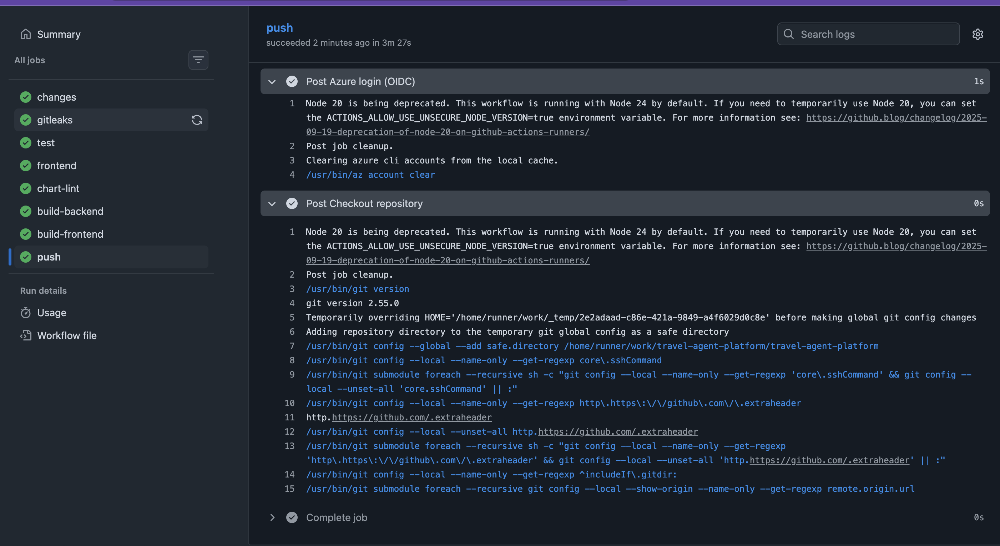

## Least Privilege vs. Operational Reality

CI's Azure role started at least privilege (RBAC Writer). Once actually deploying, it became clear that CRD resources like `Gateway` and `HTTPRoute` weren't covered by any built-in role below Cluster Admin — Azure's built-in Kubernetes-authorization roles below Cluster Admin don't extend to custom resources at all. CI was temporarily elevated to Cluster Admin, and that trade-off was recorded as a deliberate deviation to revisit later (tracked in [`docs/plan.md` Step 13](plan.md)) — not accepted as a final answer.

**How it works today:**

```hcl
# Infrastructure/terraform/cluster/role-assignments.tf
resource "azurerm_role_assignment" "ci_aks_rbac_cluster_admin" {
  scope                = azurerm_kubernetes_cluster.this.id
  role_definition_name = "Azure Kubernetes Service RBAC Cluster Admin"
  principal_id         = var.ci_identity_principal_id
}
```

**Verifying the gap first-hand**, via `kubectl auth can-i`:

```
$ kubectl auth can-i create clusterrolebindings
Warning: resource 'clusterrolebindings' is not namespace scoped in group 'rbac.authorization.k8s.io'
yes
```

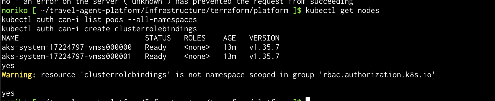

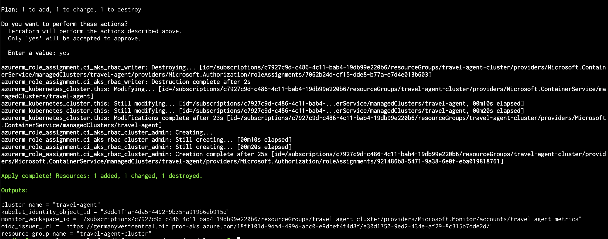

## No External Exposure

The Gateway sits on an internal load balancer with no public IP — reachable only through a `kubectl port-forward` tunnel, which is already authenticated and encrypted by the Kubernetes API server. This is a deliberate design choice for this stage, and it's also the operational constraint the next step (launching and reaching the cluster from a browser, [`docs/plan.md` Step 10](plan.md)) is meant to revisit.

**Verifying it against the actual IP allocation, not just configuration intent:**

```
$ az network public-ip list -g MC_travel-agent-cluster_travel-agent_germanywestcentral -o table
Name           ...  Address
a71a91bb-...   ...  4.182.97.209

$ az network public-ip show ... --query "ipConfiguration.id" -o tsv
.../loadBalancers/kubernetes/frontendIPConfigurations/a71a91bb-...
```

The one public IP in the node resource group is bound to the AKS-managed *outbound* load balancer (egress/SNAT) — not to the Gateway's own internal load balancer. Full record: [Task 9.6](step9-raise-evidence.md).

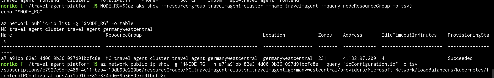

## Verifying Statelessness

The RAG corpus lives on a `ReadWriteOnce` PVC, not in the pod's own filesystem:

```yaml
# Infrastructure/helm/travel-agent/templates/backend-deployment.yaml
volumeMounts:
  - name: chroma-data
    mountPath: /app/rag/chroma_db
```

The backend pod was deliberately deleted mid-session. After a new pod came up, the same RAG-grounded question was asked again — not compared for identical text (the model has no `temperature=0` set, so exact phrasing isn't expected to match), but checked fact-by-fact against the six distinctive facts the corpus document actually contains:

| Fact | Before | After |
|---|---|---|
| Grey peas with bacon | ✓ | ✓ |
| Dark rye bread | ✓ | ✓ |
| Pīrāgi pastries | ✓ | ✓ |
| Riga Central Market | ✓ | ✓ |
| June–August, warm, outdoor cafes | ✓ | ✓ |
| December, Christmas markets | ✓ | ✓ |

All six facts matched; only the wording differed. Full record: [Task 9.7](step9-raise-evidence.md).

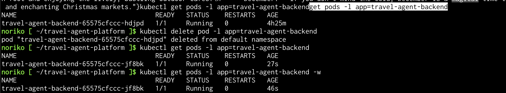
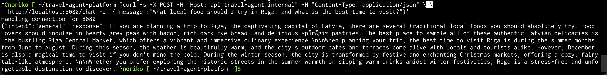

## Fault Injection: Revoking Key Vault Access

To verify that Workload-Identity-based secret retrieval was actually enforced (not just configured), the Key Vault role was deliberately revoked mid-session.

**What actually happened:** the new pod's CSI volume mount failed cleanly with a `403 Forbidden` (`ForbiddenByRbac`), and the pod stayed stuck at `Init:0/1` — it never reached `Running`, so it could not have served from any cached credential:

```
Warning FailedMount ... failed to get objectType:secret, objectName:google-api-key ...
RESPONSE 403: Forbidden, ERROR CODE: Forbidden, innererror.code: ForbiddenByRbac
```

After restoring the role assignment, no manual pod action was needed — kubelet was already retrying the failed mount automatically. Time from the restore command to the pod reaching `Running`/`Ready`: **~1.5 minutes**. Full record: [Task 9.15](step9-raise-evidence.md).

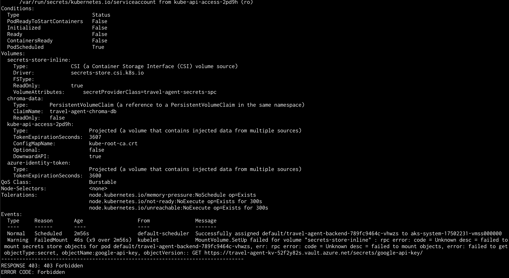
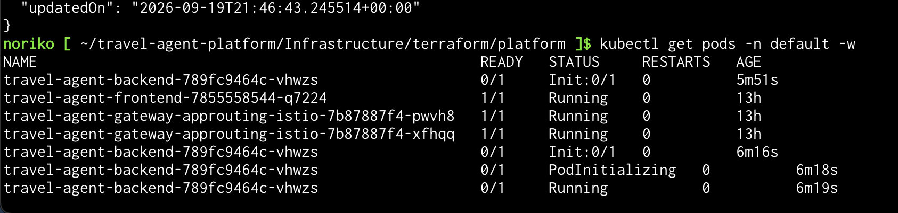

## Observability: Managed Prometheus → Local Grafana

Azure Monitor's managed Prometheus scrapes the cluster (`cluster.tf`'s `monitor_metrics` block); the existing local Grafana — the same one used for the Docker Compose stack — was given a second datasource pointed at that workspace, via the `grafana-azureprometheus-datasource` plugin (core Prometheus's Azure AD auth path is deprecated in Grafana 13). The original local `Prometheus` datasource and its history are untouched; both coexist.

Queried directly against the cluster: backend/frontend CPU usage (`rate(container_cpu_usage_seconds_total...)`), memory working set (backend ~145–150 MB, frontend ~72 MB), and CPU throttling — all real, non-zero, scoped to the running containers. Full record: [Task 9.10](step9-raise-evidence.md), [Task 9.11](step9-raise-evidence.md), [Task 9.12](step9-raise-evidence.md).

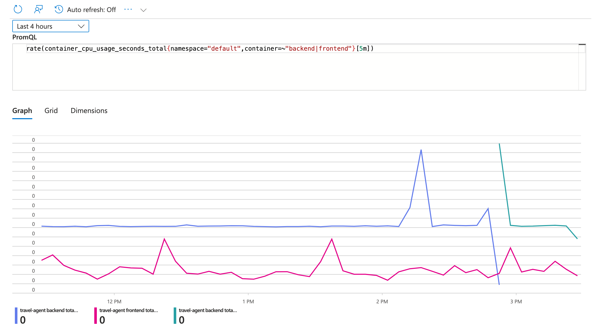
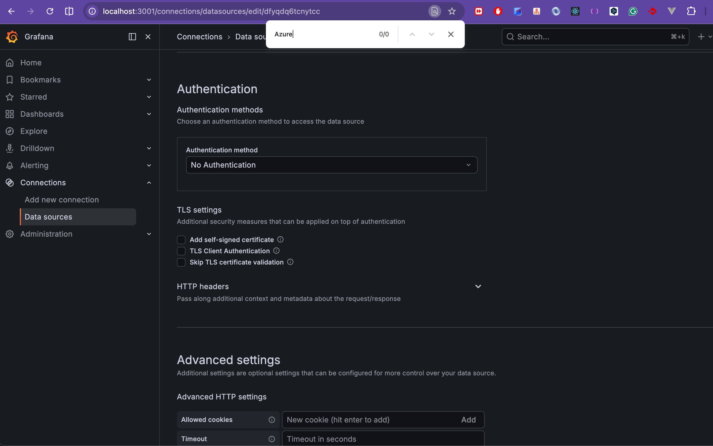
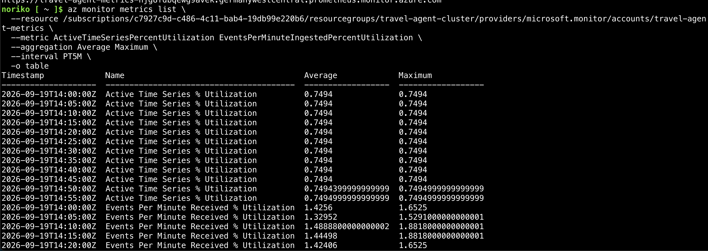

## Clean Teardown

At the end of a work session, the cluster layer is fully destroyed while the platform layer (ACR, Key Vault, Identities) survives intact.

```
$ terraform destroy \
    -var="acr_id=..." -var="ci_identity_principal_id=..." -var="region=..."
Destroy complete! Resources: 11 destroyed.

$ az resource list --resource-group travel-agent-cluster -o table
ResourceGroupNotFound
```

`ResourceGroupNotFound` is a stronger confirmation than an empty list — the cluster resource group is itself one of the 11 destroyed resources. The platform resource group's 4 resources (registry, vault, both identities) are confirmed still present and `Succeeded` separately. Standing cost after teardown: ≈$5/month (ACR alone). Full record: [Tasks 10.1–10.3](step9-raise-evidence.md).

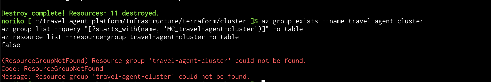
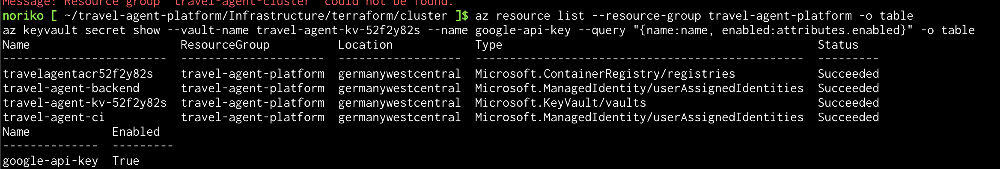

## What Went Wrong (and How It Was Resolved)

**1. The documented node SKU wasn't actually available, and neither was its replacement — a subscription-wide vCPU quota forced a real sizing deviation.** The design's original choice, `Standard_D4as_v5`, was rejected by the subscription (a whole-family restriction, not a capacity issue). The first correction, `Standard_D4s_v7`, raised the cost floor to ≈$0.674/hour — but `az vm list-usage` then showed this Free Trial subscription capped at **4 total regional vCPUs across every VM family combined**, and 2 nodes × `Standard_D4s_v7` (8 vCPU) exceeded that outright, confirmed by `terraform apply` failing with `ErrCode_InsufficientVCPUQuota`. The final correction, `Standard_D2s_v7` (2 vCPU/8 GiB), is below AKS's documented 4 vCPU / 16 GiB system-pool minimum — a deliberate, owner-approved deviation driven by the quota, not a revision of the sizing reasoning. Final cost floor: ≈$0.365/hour.

**2. The Key Vault → Kubernetes Secret sync requires the pod to actually mount the CSI volume — confirmed both in docs and on a live cluster.** Microsoft's own CSI driver docs state the synced Secret is materialized only once a pod mounts the volume, and deleted again once the last consuming pod is removed. This was recorded before implementation, then reconfirmed on the raised cluster: the synced Secret has no other origin (no standalone `Secret` manifest anywhere in the chart), so the mount is what produces it.

**3. Secret rotation via `az keyvault secret set` doesn't reach a running container — a restart is required, and it's easy to forget.** The CSI mount and the synced Kubernetes Secret update automatically, but `GOOGLE_API_KEY` is read as an environment variable via `secretKeyRef`, and Kubernetes populates a container's environment from a Secret exactly once, at container start. Rotation isn't complete until `kubectl rollout restart deployment/travel-agent-backend` runs — nothing in the design makes that restart automatic.

**4. CI's `helm upgrade --install` failed outright under least-privilege RBAC — the chart's CRDs weren't covered by any role short of Cluster Admin.** The actual failure from CI:

```
gateways.gateway.networking.k8s.io ... is forbidden: User ... does not have access to the resource in Azure
```

Checked against Microsoft's own docs: Azure RBAC for Kubernetes Authorization's built-in roles below Cluster Admin don't extend to custom resources at all. CI was widened to Cluster Admin as a documented, deliberate deviation (see "Least Privilege vs. Operational Reality" above) rather than building a properly CRD-scoped custom role under time pressure.

## Known Limitations / Next Steps

Not designed or scheduled yet — tracked in [`docs/plan.md`](plan.md):

- **[Step 11](plan.md): Private networking.** The Gateway carries plain HTTP on an internal load balancer (no TLS), and there are no private endpoints — the registry and Key Vault are reached over their public endpoints today, with no VNet this repository owns.
- **[Step 12](plan.md): IaC quality gates + remote state.** Both Terraform states are local right now (suits one operator, but no locking and no shared source of truth), and the CI pipeline doesn't validate the Terraform itself.
- **[Step 13](plan.md): Container image and Helm chart hardening**, including revisiting CI's temporary Cluster Admin role in favor of a namespace-scoped custom role or Kubernetes RBAC covering only the chart's objects and CRDs.
- **[Step 14](plan.md): A managed data service.** Everything the workload stores today lives on the single RWO PVC (ChromaDB); no managed database or storage account is in the architecture yet.

## Links

- [Repository](https://github.com/Taliko5/travel-agent-platform)
- Full decision log: [`design.md`](https://github.com/Taliko5/travel-agent-platform/blob/main/openspec/changes/step9-aks-deployment/design.md)
- Verification evidence: [`step9-raise-evidence.md`](https://github.com/Taliko5/travel-agent-platform/blob/main/docs/step9-raise-evidence.md)
