# Running an AI Travel Agent on Azure AKS as a Disposable Cluster

<style>
.lightbox-link img {
  max-width: 100%;
  cursor: zoom-in;
  border-radius: 4px;
}
.lightbox-overlay {
  display: none;
  position: fixed;
  top: 0; left: 0;
  width: 100%; height: 100%;
  background: rgba(0, 0, 0, 0.88);
  z-index: 1000;
  align-items: center;
  justify-content: center;
}
.lightbox-overlay:target {
  display: flex;
}
.lightbox-overlay-bg {
  display: flex;
  align-items: center;
  justify-content: center;
  width: 100%;
  height: 100%;
  cursor: zoom-out;
}
.lightbox-overlay img {
  max-width: 92%;
  max-height: 92%;
  box-shadow: 0 0 40px rgba(0,0,0,0.6);
  border-radius: 4px;
}
.lightbox-overlay img.lightbox-svg {
  width: 92vw;
  height: auto;
}
</style>

An AI travel-planning agent built on LangGraph, RAG (ChromaDB), and tools written as MCP servers, taken from local Docker Compose development through GitHub Actions CI/CD to a production-realistic Azure Kubernetes Service (AKS) deployment. Built on an Azure Free Trial subscription, whose 4-vCPU regional quota forced a real sizing deviation (see "What Went Wrong"). Every non-trivial decision is recorded as it was made, and every claim on this page is sourced from the evidence log or the infrastructure code linked next to it.

**Stack:** Python/FastAPI/LangGraph, ChromaDB, Next.js, Terraform, AKS (Istio Gateway API, Workload Identity, Managed Prometheus), GitHub Actions (OIDC, no stored secrets)

**Chat UI:** the app running against the backend on AKS, reached through `kubectl port-forward`.

<div class="lightbox-overlay" id="lb-chat-demo"><a href="#" class="lightbox-overlay-bg">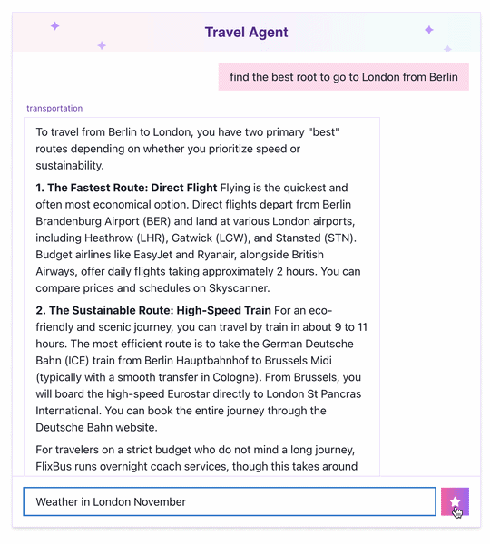</a></div>
<a href="#lb-chat-demo" class="lightbox-link"></a>

[Full repository](https://github.com/Taliko5/travel-agent-platform) — the complete decision log lives in [`design.md`](https://github.com/Taliko5/travel-agent-platform/blob/main/openspec/changes/archive/2026-09-30-step9-aks-deployment/design.md), and verification evidence lives in [`step9-raise-evidence.md`](https://github.com/Taliko5/travel-agent-platform/blob/main/docs/step9-raise-evidence.md).

## Architecture

**Current architecture:** what is deployed today.

<div class="lightbox-overlay" id="lb-architecture"><a href="#" class="lightbox-overlay-bg"></a></div>
<a href="#lb-architecture" class="lightbox-link"></a>

The Istio-based Gateway API implementation of the AKS application-routing add-on was chosen as the ingress over managed NGINX (its Azure security-patch support ends within months and its upstream project is already unmaintained) and over Application Gateway for Containers (its extra capabilities — mTLS to backends, weighted traffic splitting — aren't needed here, and it adds a separately-billed, separately-lifecycled resource), per [`design.md` D2](https://github.com/Taliko5/travel-agent-platform/blob/main/openspec/changes/archive/2026-09-30-step9-aks-deployment/design.md).

**How the agent works.** Each question is classified by intent and routed either to a tool (weather, flights, hotels) or to RAG retrieval, and the answer is generated from the result. The tools are written as MCP servers (FastMCP) and can run on their own, but in this deployment the agent imports them and calls them in-process as plain functions — the MCP protocol isn't used at runtime. Weather is live data from Open-Meteo; flights and hotels return mock data. Running the tools as real MCP services is tracked in [`docs/plan.md` Step 15](plan.md).

### Inside the cluster

Everything the Helm chart deploys lives in the `default` namespace. Traffic enters only through the Gateway, which the AKS app-routing add-on turns into Istio gateway pods behind an internal load balancer; each HTTPRoute sends one hostname to one ClusterIP Service.

**Request path and storage:** from the operator's tunnel through the Gateway to the frontend and backend, and the backend's ChromaDB data on a persistent volume.

<div class="lightbox-overlay" id="lb-k8s-request"><a href="#" class="lightbox-overlay-bg"></a></div>
<a href="#lb-k8s-request" class="lightbox-link"></a>

**Secret delivery:** how `GOOGLE_API_KEY` reaches the backend without a stored password — the pod's Kubernetes identity is exchanged for Entra ID access to Key Vault.

<div class="lightbox-overlay" id="lb-k8s-secrets"><a href="#" class="lightbox-overlay-bg"></a></div>
<a href="#lb-k8s-secrets" class="lightbox-link"></a>

## Why AKS

The goal was hands-on Kubernetes practice, not the cheapest way to host two small services. At this scale Azure Container Apps would likely be simpler and cheaper; AKS was chosen deliberately to work through the parts a managed PaaS hides — ingress via the Gateway API, Workload Identity, RBAC, Helm releases, and cluster raise/teardown.

## Why a Disposable Cluster

To stay within the Free Trial subscription's cost and quota limits while still validating a production-realistic setup, Terraform state is split into two layers. The **platform layer** (ACR, Key Vault, Managed Identities) is applied once and persists. The **cluster layer** (the AKS cluster itself) is raised and torn down for each work session.

## Key Numbers

The numbers that matter for a cluster that only exists while it's being used: what it costs up and torn down, how quickly it recovered in the fault-injection test, and how much of the monitoring workspace's default limits the workload actually used. The two cost rows are estimates from Azure list prices; the other three were measured on the running cluster. Each row links to its source.

| Metric | Value | Source |
|---|---|---|
| Cost while the cluster is up | ≈$0.365/hour (2× `Standard_D2s_v7` node + disk + load balancer + IP) | [`design.md` D14](https://github.com/Taliko5/travel-agent-platform/blob/main/openspec/changes/archive/2026-09-30-step9-aks-deployment/design.md) |
| Standing cost after teardown | ≈$5/month (ACR alone; everything else is free at rest) | [`design.md` D10](https://github.com/Taliko5/travel-agent-platform/blob/main/openspec/changes/archive/2026-09-30-step9-aks-deployment/design.md) |
| Key Vault access restored → pod Ready | ~1.5 minutes | [Task 9.15](step9-raise-evidence.md#task-9-15) |
| Active Prometheus time series vs. workspace limit | ~7,494 of 1,000,000 (0.75%) | [Task 9.12](step9-raise-evidence.md#task-9-12) |
| Events ingested/min vs. workspace limit | ~13,700–18,818 of 1,000,000 (1.4–1.9%) | [Task 9.12](step9-raise-evidence.md#task-9-12) |

## Deploying Without Long-Lived Credentials

The pipeline (`.github/workflows/ci.yml`) runs on every push and pull request to `main` and `release`:

| Job | Runs when | What it does |
|---|---|---|
| `gitleaks` | Always | Scans the repository for committed secrets |
| `changes` | Always | Detects whether `backend/`, `frontend/` or the Helm chart changed; later jobs skip their steps when their path didn't change |
| `test` | Backend changed | `ruff` lint and format check, `pytest` |
| `frontend` | Frontend changed | ESLint, Vitest, production build |
| `build-backend` / `build-frontend` | After `test` / `frontend`, when that side changed | Builds the Docker image and scans it with Trivy (results are uploaded; findings don't fail the build yet — see Step 13) |
| `chart-lint` | Helm chart changed | Renders the chart and client-side dry-run applies it to a throwaway `kind` cluster with the Gateway API and Secrets Store CSI CRDs installed |
| `push` | Push to `release` only, after both build jobs | OIDC login to Azure, builds and pushes both images to ACR, then deploys to AKS with `helm upgrade --install` |

A deploy happens when a pull request from `main` is merged into `release`. The deploy step waits for the workload to become ready and dumps diagnostics to the job log if it doesn't; a merge while no cluster is raised fails by design rather than passing silently. Full record: [`docs/step10-evidence.md`](step10-evidence.md), [`openspec/changes/step10-release-branch-deploy/`](https://github.com/Taliko5/travel-agent-platform/blob/main/openspec/changes/step10-release-branch-deploy/proposal.md).

CI holds no long-lived Azure secrets at all. It authenticates via OIDC federation, requesting a short-lived token on each run to push to ACR and deploy to AKS.

**How it works.** The CI identity's federated credential pins its trust to one repository and one branch — nothing else can mint a token as this identity:

```hcl
# Infrastructure/terraform/platform/identities.tf
resource "azurerm_federated_identity_credential" "ci" {
  audience = ["api://AzureADTokenExchange"]
  issuer   = "https://token.actions.githubusercontent.com"
  subject  = "repo:${var.github_repository}:ref:refs/heads/${var.ci_deploy_branch}"
  # resolves to: repo:Taliko5/travel-agent-platform:ref:refs/heads/release
  # …
}
```

The backend pod's own federated credential is different: it trusts the AKS cluster's OIDC issuer URL, which doesn't exist until the cluster is raised. That creates a bootstrapping order — the platform state is applied twice per raise, once before the cluster exists (issuer URL empty, credential skipped) and once after (issuer URL supplied, credential created):

```
$ terraform apply \
  -var="operator_object_id=$(az ad signed-in-user show --query id -o tsv)" \
  -var="aks_oidc_issuer_url=$(terraform -chdir=../cluster output -raw oidc_issuer_url)"

azurerm_federated_identity_credential.backend_serviceaccount[0]: Modifying...
Apply complete! Resources: 0 added, 1 changed, 0 destroyed.
```

`terraform output backend_federated_credential_configured` → `true` confirms it. Full record: [Task 8.6.1](step9-raise-evidence.md#task-8-6-1).

**Deploying from CI:** every job green, and the `push` job's `helm upgrade --install` step installing the release on a freshly raised cluster (`STATUS: deployed`, `Install complete`). This screenshot dates from Step 9, when the `push` job still ran on `main`.

<div class="lightbox-overlay" id="lb-ci-helm"><a href="#" class="lightbox-overlay-bg">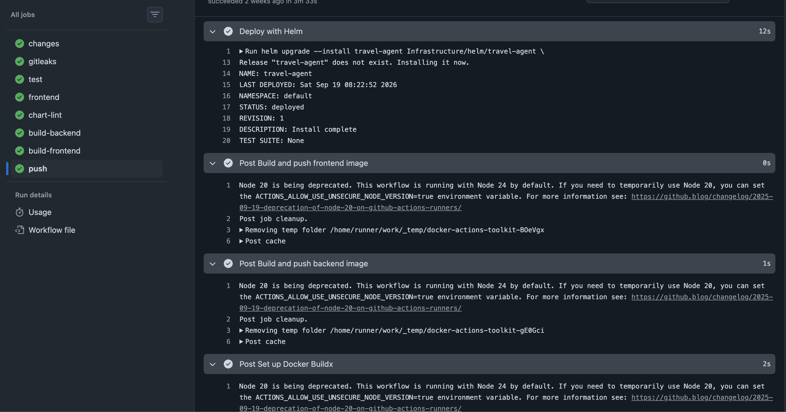</a></div>
<a href="#lb-ci-helm" class="lightbox-link"></a>

**Logging in without stored credentials:** the `push` job's Azure login step runs over OIDC, and its post-step clears the Azure CLI session from the runner (`az account clear`).

<div class="lightbox-overlay" id="lb-ci-pipeline"><a href="#" class="lightbox-overlay-bg">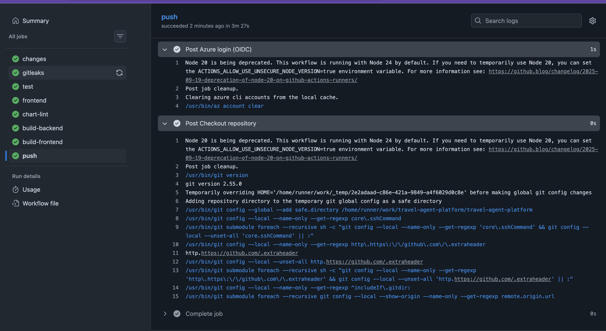</a></div>
<a href="#lb-ci-pipeline" class="lightbox-link"></a>

## Least Privilege vs. Operational Reality

CI's Azure role started at least privilege (RBAC Writer). Once actually deploying, it became clear that CRD resources like `Gateway` and `HTTPRoute` weren't covered by any built-in role below Cluster Admin — Azure's built-in Kubernetes-authorization roles below Cluster Admin don't extend to custom resources at all. CI was temporarily elevated to Cluster Admin, and that trade-off was recorded as a deliberate deviation to revisit later (tracked in [`docs/plan.md` Step 13](plan.md)) — not accepted as a final answer.

**How it works today:**

```hcl
# Infrastructure/terraform/cluster/role-assignments.tf
resource "azurerm_role_assignment" "ci_aks_rbac_cluster_admin" {
  scope                = azurerm_kubernetes_cluster.this.id
  role_definition_name = "Azure Kubernetes Service RBAC Cluster Admin"
  principal_id         = var.ci_identity_principal_id
  # …
}
```

**The actual failure from CI** under least-privilege RBAC:

```
gateways.gateway.networking.k8s.io ... is forbidden: User ... does not have access to the resource in Azure
```

**Widening CI's role:** Terraform removes the RBAC Writer assignment and creates the Cluster Admin one.

<div class="lightbox-overlay" id="lb-d4-rbac"><a href="#" class="lightbox-overlay-bg">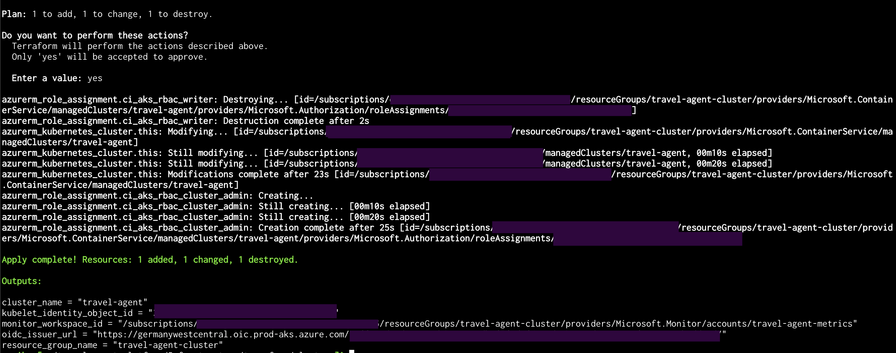</a></div>
<a href="#lb-d4-rbac" class="lightbox-link"></a>

## No External Exposure

The Gateway sits on an internal load balancer with no public IP — reachable only through a `kubectl port-forward` tunnel, which is already authenticated and encrypted by the Kubernetes API server. This is a deliberate design choice for this stage, and it's also the operational constraint the next step (launching and reaching the cluster from a browser, [`docs/plan.md` Step 10](plan.md)) is meant to revisit.

**Verifying it against the actual IP allocation, not just configuration intent:**

```
$ az network public-ip list -g MC_travel-agent-cluster_travel-agent_germanywestcentral -o table
Name           ...  Address
a71a91bb-...   ...  4.182.97.209

$ az network public-ip show ... --query "ipConfiguration.id" -o tsv
/subscriptions/<redacted>/.../loadBalancers/kubernetes/frontendIPConfigurations/<outbound-public-ip-name>
```

The one public IP in the node resource group is bound to the AKS-managed *outbound* load balancer (egress/SNAT) — not to the Gateway's own internal load balancer. Full record: [Task 9.6](step9-raise-evidence.md#task-9-6).

**The only public IP:** it belongs to `loadBalancers/kubernetes`, the AKS-managed outbound load balancer — not to the Gateway.

<div class="lightbox-overlay" id="lb-no-public-ip"><a href="#" class="lightbox-overlay-bg">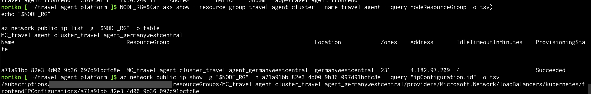</a></div>
<a href="#lb-no-public-ip" class="lightbox-link"></a>

## Data Survives Pod Replacement

The RAG corpus lives on a `ReadWriteOnce` PVC, not in the pod's own filesystem:

```yaml
# Infrastructure/helm/travel-agent/templates/backend-deployment.yaml
volumeMounts:
  - name: chroma-data
    mountPath: /app/rag/chroma_db
```

The backend pod was deliberately deleted mid-session, and the same question was asked before and after (*"What local food should I try in Riga, and what is the best time to visit?"*). Both answers contained the same six facts from the Riga guide in the RAG corpus (`backend/rag/data/riga.txt`); only the wording differed, since the model has no `temperature=0` set. Full record: [Task 9.7](step9-raise-evidence.md#task-9-7).

**Direct check:** the first pod's `rag-ingest` log read "Saved 4 documents to Chroma at rag/chroma_db"; after deleting that pod, the replacement's `rag-ingest` log read "Chroma store at rag/chroma_db already has documents, skipping ingestion" — the PVC's data, not a fresh ingest, is what the replacement pod found. Full record: [`docs/step10-evidence.md`](step10-evidence.md#task-8-2-second-attempt-cluster-raised).

**Deleting the backend pod:** Kubernetes starts a replacement, which is `Running` within seconds.

<div class="lightbox-overlay" id="lb-pod-delete"><a href="#" class="lightbox-overlay-bg">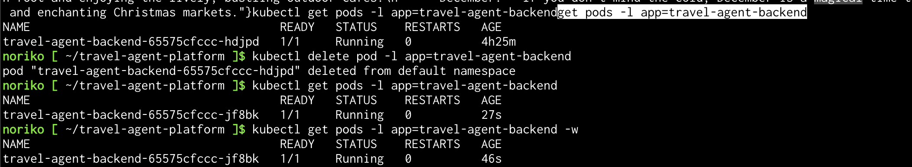</a></div>
<a href="#lb-pod-delete" class="lightbox-link"></a>
**Asking the new pod the same question:** the answer still contains the same six facts from the Riga guide.

<div class="lightbox-overlay" id="lb-chat-after-delete"><a href="#" class="lightbox-overlay-bg">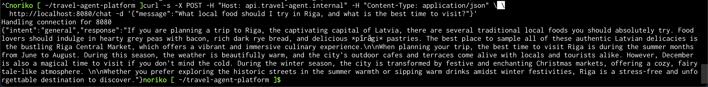</a></div>
<a href="#lb-chat-after-delete" class="lightbox-link"></a>

## Fault Injection: Revoking Key Vault Access

To verify that Workload-Identity-based secret retrieval was actually enforced (not just configured), the Key Vault role was deliberately revoked mid-session.

**What actually happened:** the new pod's CSI volume mount failed cleanly with a `403 Forbidden` (`ForbiddenByRbac`), and the pod stayed stuck at `Init:0/1` — it never reached `Running`, so it could not have served from any cached credential:

```
Warning FailedMount ... failed to get objectType:secret, objectName:google-api-key ...
RESPONSE 403: Forbidden, ERROR CODE: Forbidden, innererror.code: ForbiddenByRbac
```

After restoring the role assignment, no manual pod action was needed — kubelet was already retrying the failed mount automatically. Time from the restore command to the pod reaching `Running`/`Ready`: **~1.5 minutes**. Full record: [Task 9.15](step9-raise-evidence.md#task-9-15).

**With the Key Vault role revoked:** the secret volume fails to mount (`FailedMount`, `403 Forbidden`), so the pod never starts.

<div class="lightbox-overlay" id="lb-keyvault-failure"><a href="#" class="lightbox-overlay-bg">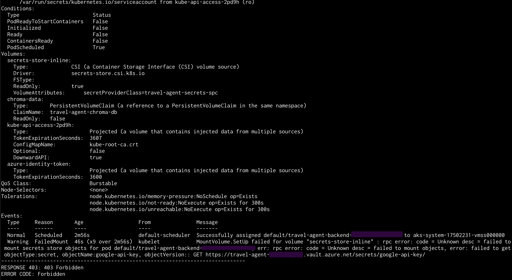</a></div>
<a href="#lb-keyvault-failure" class="lightbox-link"></a>
**After the role is restored:** the same pod moves from `Init:0/1` to `PodInitializing` to `Running`, with no manual action.

<div class="lightbox-overlay" id="lb-keyvault-recovered"><a href="#" class="lightbox-overlay-bg">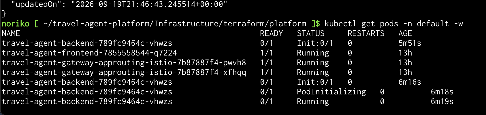</a></div>
<a href="#lb-keyvault-recovered" class="lightbox-link"></a>

## Observability

### Application metrics, designed locally

Before the AKS work, the backend's own metrics were designed on the local Docker Compose stack (Prometheus + Grafana): end-to-end request latency (`chat_request_duration_seconds`), per-LLM-call latency by graph node (`llm_call_duration_seconds`), and intent classification counts (`intent_classification_total`). A committed script, `scripts/generate_load.py`, sends 60 real requests at about 10 per minute — a pace set by the Gemini free tier, not a throughput test — to produce a real latency distribution. Most of each request's time is spent waiting on Gemini.

The main lesson: histogram bucket boundaries have to follow the data. The first set for `llm_call_duration_seconds` was a guess, and one measured run showed it put resolution where there was no traffic and none where there was:

| | Bucket boundaries (seconds) |
|---|---|
| Initial guess | 0.1, 0.25, 0.5, 1.0, 2.0, 3.0, 5.0, 7.0, 10.0, 20.0 |
| After one measured re-tune | 0.5, 1.0, 1.5, 2.0, 3.0, 4.0, 5.0, 6.0, 7.0, 10.0, 30.0 |

`classify_intent` put about 88% of its calls into a single bucket (1.0–2.0 s), and `generate_response` spread across 3.0–7.0 s with no finer cut, while the 0.1 and 0.25 boundaries never held a single observation. The re-tune dropped the empty low boundaries and added cuts where calls actually land. Full reasoning: [step8-metric-design `design.md` D18](https://github.com/Taliko5/travel-agent-platform/blob/main/openspec/changes/archive/2026-08-25-step8-metric-design/design.md).

These application metrics are scraped by the local Prometheus only. On AKS, Managed Prometheus currently collects container-level metrics, not the backend's `/metrics` endpoint.

### On AKS: Managed Prometheus → Local Grafana

Azure Monitor's managed Prometheus scrapes the cluster (`cluster.tf`'s `monitor_metrics` block); the existing local Grafana — the same one used for the Docker Compose stack — was given a second datasource pointed at that workspace, via the `grafana-azureprometheus-datasource` plugin (core Prometheus's Azure AD auth path is deprecated in Grafana 13). The original local `Prometheus` datasource and its history are untouched; both coexist.

Queried directly against the cluster: backend/frontend CPU usage (`rate(container_cpu_usage_seconds_total...)`), memory working set, and CPU throttling — all real, non-zero, scoped to the running containers. Full record: [Task 9.10](step9-raise-evidence.md#task-9-10), [Task 9.11](step9-raise-evidence.md#task-9-11), [Task 9.12](step9-raise-evidence.md#task-9-12).

**Managed Prometheus in the Azure portal:** memory working set of the backend and frontend containers.

<div class="lightbox-overlay" id="lb-azure-monitor"><a href="#" class="lightbox-overlay-bg">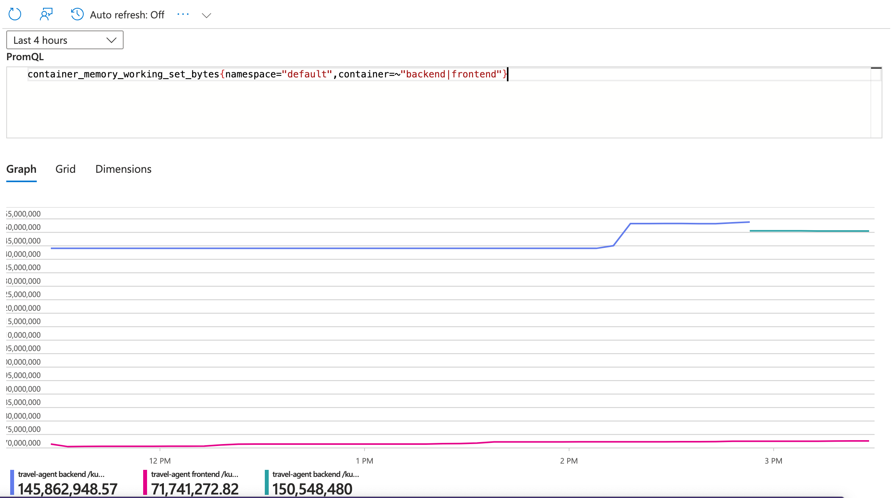</a></div>
<a href="#lb-azure-monitor" class="lightbox-link"></a>
**Local Grafana querying the cluster's workspace:** CPU usage per pod, through the `grafana-azureprometheus-datasource` plugin.

<div class="lightbox-overlay" id="lb-grafana-explore"><a href="#" class="lightbox-overlay-bg">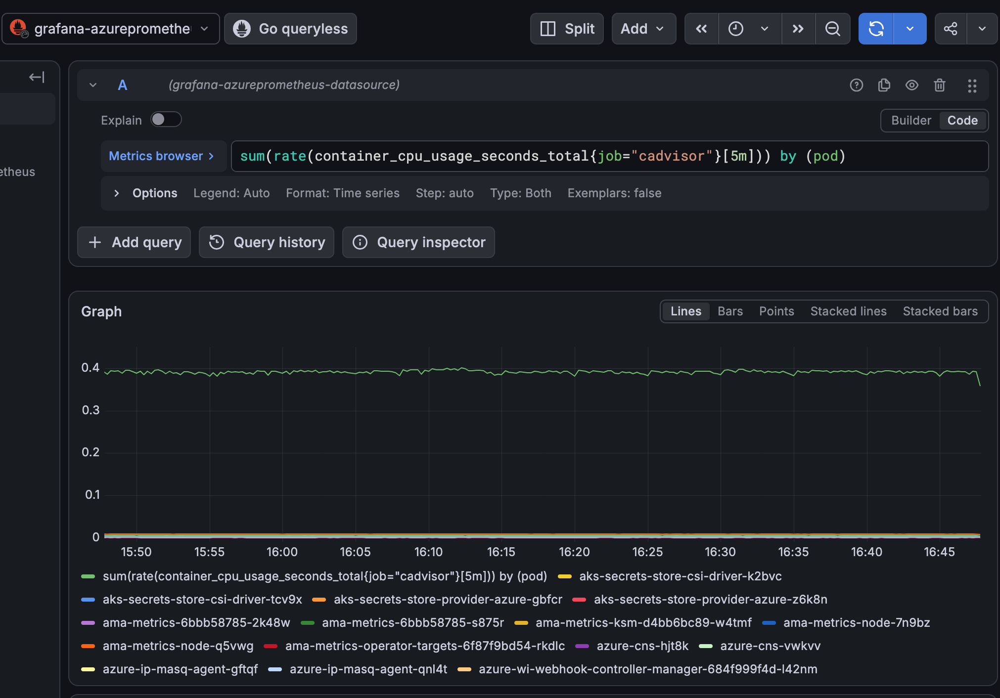</a></div>
<a href="#lb-grafana-explore" class="lightbox-link"></a>
**The workspace's own utilization metrics:** active time series and ingested events as a percentage of the default limits.

<div class="lightbox-overlay" id="lb-ingestion"><a href="#" class="lightbox-overlay-bg">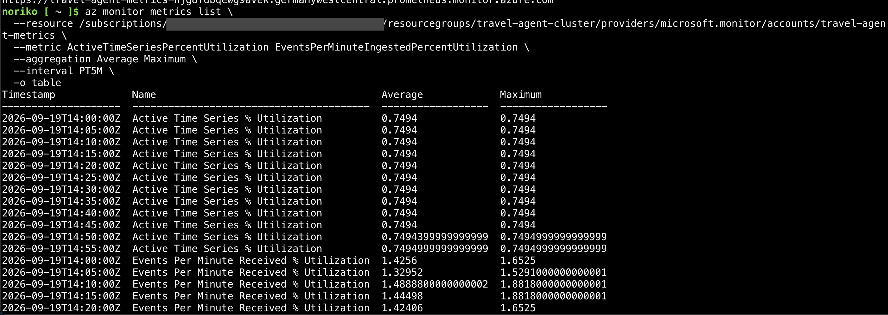</a></div>
<a href="#lb-ingestion" class="lightbox-link"></a>

## Clean Teardown

At the end of a work session, the cluster layer is fully destroyed while the platform layer (ACR, Key Vault, Identities) survives intact.

```
$ terraform destroy \
    -var="acr_id=..." -var="ci_identity_principal_id=..." -var="region=..."
Destroy complete! Resources: 11 destroyed.

$ az resource list --resource-group travel-agent-cluster -o table
ResourceGroupNotFound
```

`ResourceGroupNotFound` is a stronger confirmation than an empty list — the cluster resource group is itself one of the 11 destroyed resources. The platform resource group's 4 resources (registry, vault, both identities) are confirmed still present and `Succeeded` separately. Standing cost after teardown: ≈$5/month (ACR alone). Full record: [Tasks 10.1–10.3](step9-raise-evidence.md#task-10-1).

**Tearing down the cluster:** `terraform destroy`, then confirmation that the cluster resource group no longer exists.

<div class="lightbox-overlay" id="lb-destroy-complete"><a href="#" class="lightbox-overlay-bg">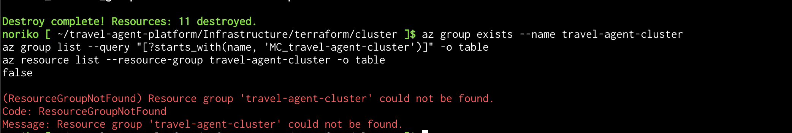</a></div>
<a href="#lb-destroy-complete" class="lightbox-link"></a>
**The platform layer after teardown:** registry, Key Vault and both identities still present, and the API key secret still enabled.

<div class="lightbox-overlay" id="lb-platform-survives"><a href="#" class="lightbox-overlay-bg">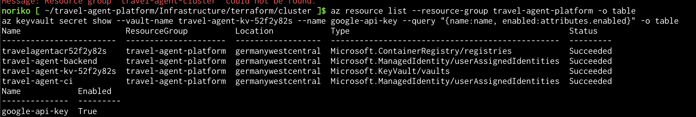</a></div>
<a href="#lb-platform-survives" class="lightbox-link"></a>

## What Went Wrong

**1. The documented node SKU wasn't actually available, and neither was its replacement — a subscription-wide vCPU quota forced a real sizing deviation.** The design's original choice, `Standard_D4as_v5`, was rejected by the subscription (a whole-family restriction, not a capacity issue). The first correction, `Standard_D4s_v7`, raised the cost floor to ≈$0.674/hour — but `az vm list-usage` then showed this Free Trial subscription capped at **4 total regional vCPUs across every VM family combined**, and 2 nodes × `Standard_D4s_v7` (8 vCPU) exceeded that outright, confirmed by `terraform apply` failing with `ErrCode_InsufficientVCPUQuota`. The final correction, `Standard_D2s_v7` (2 vCPU/8 GiB), is below AKS's documented 4 vCPU / 16 GiB system-pool minimum — a deliberate, owner-approved deviation driven by the quota, not a revision of the sizing reasoning. Final cost floor: ≈$0.365/hour.

**2. CI's deploy step failed after teardown with `AuthorizationFailed`, not a not-found error.** CI's role assignment onto the cluster (`ci_aks_cluster_user` / `ci_aks_rbac_cluster_admin`) is declared in the cluster Terraform state, the same state Section 10 destroys — so the grant is destroyed along with the cluster itself. Azure's control plane answers an unauthorized caller with `AuthorizationFailed` rather than revealing whether the resource exists, so the error text alone doesn't distinguish "no access" from "doesn't exist" — but either way this is a designed consequence of teardown, not a regression: the build-and-push half of the same run still succeeded. Quoted verbatim from the run:

```
ERROR: (AuthorizationFailed) The client '***' with object id '<ci-identity-principal-id>' does not have authorization to perform action 'Microsoft.ContainerService/managedClusters/listClusterUserCredential/action' over scope '/subscriptions/<subscription-id>/resourceGroups/travel-agent-cluster/providers/Microsoft.ContainerService/managedClusters/travel-agent' or the scope is invalid. If access was recently granted, please refresh your credentials.
```

Full record: [Task 10.4](step9-raise-evidence.md#task-10-4). This is why [`docs/plan.md` Step 10](plan.md) separates integration from deploy triggers, implemented in [`openspec/changes/step10-release-branch-deploy/`](https://github.com/Taliko5/travel-agent-platform/blob/main/openspec/changes/step10-release-branch-deploy/proposal.md).

## Known Limitations / Next Steps

Known limitations today, and planned next steps tracked in [`docs/plan.md`](plan.md):

- **Secret rotation isn't hands-off.** `GOOGLE_API_KEY` is read as an environment variable at container start (via `secretKeyRef`), so updating it in Key Vault via `az keyvault secret set` doesn't reach a running pod — `kubectl rollout restart deployment/travel-agent-backend` is required to pick it up.
- **Single replica by design.** The backend runs one replica with a `ReadWriteOnce` PVC and the `Recreate` update strategy (see `Infrastructure/helm/travel-agent/templates/backend-deployment.yaml`), so a deploy briefly takes the backend down and it can't scale out as-is. See [`design.md` D11](https://github.com/Taliko5/travel-agent-platform/blob/main/openspec/changes/archive/2026-09-30-step9-aks-deployment/design.md).
- **No cost guardrail in code.** There is no Azure budget alert defined in this repository's Terraform; tearing the cluster down relies on the operator.
- **Alerting.** No alert rules are defined yet — metrics are collected and queryable, but nothing pages on them. The backend's application metrics are not yet scraped on AKS either.
- **[Step 11](plan.md): Private networking.** The Gateway carries plain HTTP on an internal load balancer (no TLS), and there are no private endpoints — the registry and Key Vault are reached over their public endpoints today, with no VNet this repository owns.
- **[Step 12](plan.md): IaC quality gates + remote state.** Both Terraform states are local right now (suits one operator, but no locking and no shared source of truth), and the CI pipeline doesn't validate the Terraform itself.
- **[Step 13](plan.md): Container image and Helm chart hardening**, including revisiting CI's temporary Cluster Admin role in favor of a namespace-scoped custom role or Kubernetes RBAC covering only the chart's objects and CRDs.
- **[Step 14](plan.md): A managed data service.** Everything the workload stores today lives on the single RWO PVC (ChromaDB); no managed database or storage account is in the architecture yet.
- **[Step 15](plan.md): Real MCP integration.** The tool servers are called in-process rather than over the MCP protocol, and flights and hotels return mock data.

## Links

- [Repository](https://github.com/Taliko5/travel-agent-platform)
- Full decision log: [`design.md`](https://github.com/Taliko5/travel-agent-platform/blob/main/openspec/changes/archive/2026-09-30-step9-aks-deployment/design.md)
- Verification evidence: [`step9-raise-evidence.md`](https://github.com/Taliko5/travel-agent-platform/blob/main/docs/step9-raise-evidence.md)
