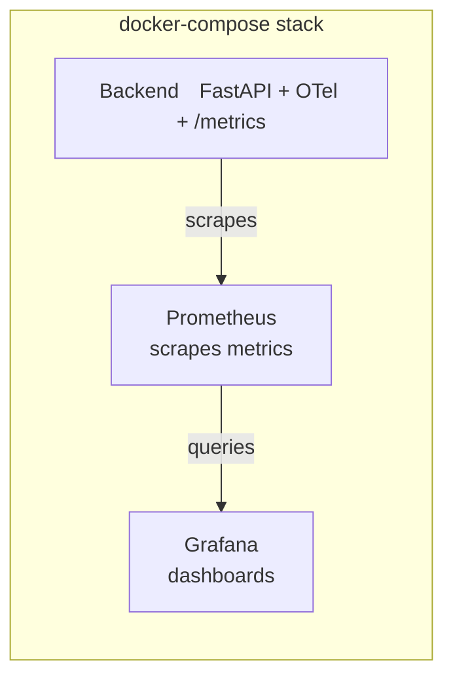
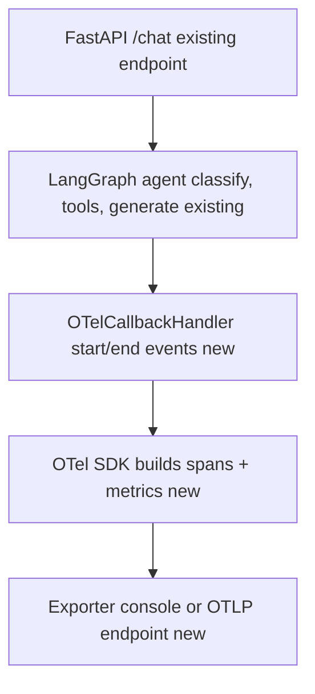

## Context

The backend is a FastAPI app (`backend/api/main.py`) that invokes a compiled LangGraph agent (`backend/agent/graph.py`) on every `POST /chat`. Today the agent has no tracing, no metrics, no `/metrics` endpoint, and no structured logging — the only visibility is unstructured stdout. `docs/plan.md` scopes Step 8 to: OTel instrumentation for FastAPI + LangGraph, Prometheus scraping, Grafana dashboards, and CloudWatch log aggregation, with four named metrics (`/chat` latency percentiles, intent distribution, LLM call duration, RAG retrieval rate).

This is the second pass at this design. The first pass scaffolded SDK wiring and compose services but left three things unaddressed that a second look at the same `docs/plan.md` scope surfaced as real gaps rather than nice-to-haves: (1) no OTel `Resource` attributes, so every span/metric is unattributable once more than one instance or service exists; (2) no way to correlate a slow trace with the log lines from that same request; (3) CloudWatch dropped to "Step 9, out of scope" entirely, when a no-AWS-dependency piece of it (emitting structured JSON logs) belongs now and saves a rework later. This design folds those in.

This change is explicitly split labor (see proposal): Claude Code scaffolds compose services and SDK wiring; the user owns metric definitions, span naming/attributes, dashboards, and making the pipeline actually show data. This design doc covers only the scaffolded half.

## Overview diagrams

Backend exposes `/metrics`, Prometheus pulls it on an interval, and Grafana queries Prometheus — matches Decision 6/7.

Unlabeled nodes are existing app code untouched by this change; the callback handler, OTel SDK, and exporter nodes are what this change adds (matches Decision 4). The LLM-call-level nested span (Migration Plan step 4 / tasks.md 4.4) isn't shown separately here since it's still pending verification, not guaranteed yet.

## Goals / Non-Goals

**Goals:**
- Stand up Prometheus + Grafana as docker-compose services that can reach the backend and each other on the compose network, **with data that survives a restart** (named volumes), so an empty dashboard after `docker-compose up` reliably means "no metrics recorded yet," not "lost on restart."
- Wire the OpenTelemetry SDK into `backend/api/main.py` so a `MeterProvider`/`TracerProvider` exist, tagged with a `Resource` identifying the service (`service.name=travel-agent-backend`, `service.version` read from the FastAPI app's existing `version="0.1.0"`, `deployment.environment` from an env var defaulting to `local`), and `FastAPIInstrumentor` auto-instruments HTTP request spans.
- Make the trace exporter destination configurable (env var), defaulting to console, so wiring a real trace backend later is a config change, not a code change.
- Expose a `/metrics` endpoint on the backend via `prometheus-client`'s ASGI app (or the OTel Prometheus exporter reader) so Prometheus has something to scrape.
- Provide span instrumentation for LangGraph node execution (and the LLM/tool calls inside those nodes) via a `BaseCallbackHandler` registered once at graph-invocation time, without deciding span names/attributes for the user or requiring changes to `backend/agent/graph.py` or `backend/agent/nodes.py`.
- Declare (not implement) instrument objects for the four key metrics as named placeholders so the user has a starting point and a consistent location to fill in.
- Add structured (JSON) request/response logging with the active `trace_id`/`span_id` injected into every log record, so a user staring at a slow span in the console exporter (or later, Grafana/Tempo) can grep logs for that exact ID.
- Add tests that exercise the new instrumentation code paths directly (not just "existing tests still pass"), since untested scaffolding is exactly the kind of thing that silently breaks and gets blamed on the user's own metric-recording work later.
- Draft `docs/step8.md` describing the "what" and "why" of the stack, leaving explicit "TODO (you)" markers for the user-owned pieces, and naming LangSmith as a considered alternative.

**Non-Goals:**
- Deciding final metric names, label sets, histogram buckets, or cardinality — user's call, since low-cardinality label design is itself the learning objective.
- Building actual Grafana dashboards (JSON models, panels, queries) — scaffolding only provisions the datasource, not dashboards.
- Actual CloudWatch log *shipping* (log group creation, IAM role, `awslogs` driver or FireLens config) — still AWS-specific and belongs with Step 9, since it needs an AWS account/log group to target. What *is* in scope now is making the logs themselves structured JSON so that shipping step is pure plumbing later.
- Modifying agent behavior, routing, or existing tests — instrumentation must be a side effect only; the callback handler observes graph/LLM/tool events without altering state flow, and `backend/agent/graph.py`/`backend/agent/nodes.py` are untouched.
- Auto-instrumenting the Gemini/LangChain client calls with a dedicated library, or wiring LangSmith — `OTelCallbackHandler` already receives `on_llm_start`/`on_llm_end` events for the LLM call inside `generate_response`/`classify_intent` (pending verification per Migration Plan step 4 that callback propagation reaches that nested call without extra wiring — see fix #2 below); LangSmith is surfaced in `docs/step8.md` as an alternative worth the user's own evaluation, not something this change adopts (it would change the observability backend, not just scaffold it, and `docs/plan.md` names the OTel/Prometheus/Grafana stack specifically).
- Alerting or SLO burn-rate rules (Prometheus Alertmanager, Grafana alerting) — not named in `docs/plan.md`'s Step 8 scope; noted as an open question for after dashboards exist.

## Decisions

**1. Prometheus pull model over push/OTLP collector.** The backend exposes `/metrics` directly (via `prometheus-client`'s `make_asgi_app()` mounted in FastAPI, or `opentelemetry-exporter-prometheus`'s reader) and Prometheus scrapes it on an interval. Alternative considered: run an OTel Collector as a sidecar that receives OTLP push and re-exports to Prometheus. Rejected for the scaffold because it adds a service and a config surface (collector pipeline YAML) the user would have to debug before ever seeing a single metric — pull-based scraping has fewer moving parts for a first end-to-end pass. The collector remains a reasonable follow-up once traces need a real OTLP backend, which the configurable-exporter decision below keeps open.

**2. Trace exporter destination is configurable via `OTEL_EXPORTER_OTLP_ENDPOINT`, 2defaulting to console when unset.** The first draft hardcoded a console-only exporter with no swap-in path, which meant "add a real trace backend" would require editing `main.py` again later. Instead, the SDK setup checks for that env var: if set, use `OTLPSpanExporter` pointed at it; if unset, fall back to `ConsoleSpanExporter`. Alternative considered: hardcode console permanently and treat "add a trace backend" as a future change's problem. Rejected because the cost of making it configurable now is a few lines, versus another proposal/design cycle later just to parameterize something that was hardcoded for no reason.

**3. OTel `Resource` attributes are set at provider-construction time, not left implicit.** `service.name`, `service.version` (reused from the FastAPI `app` object's existing `version="0.1.0"`), and `deployment.environment` (env var, default `local`) are attached to both the `TracerProvider` and `MeterProvider`. Alternative considered: skip resource attributes since there's only one service today. Rejected because (a) it's nearly free to add now, (b) every span/metric emitted without it is permanently unattributed in Prometheus/Grafana once a second service or environment (staging vs. local) exists, and retrofitting resource attributes after dashboards are built means redoing label assumptions.

**4. Span/metric instrumentation via a `BaseCallbackHandler` registered at graph-invocation time, not a wrapper applied at graph-build time.** LangGraph nodes already emit `on_chain_start`/`on_chain_end` events (and `on_llm_start`/`on_llm_end`, `on_tool_start`/`on_tool_end` for anything invoked as a LangChain Runnable) through the standard LangChain callback system. A single `OTelCallbackHandler(BaseCallbackHandler)` in `backend/observability/callback_handler.py` translates those events into OTel spans, and is passed once via `config={"callbacks": [OTelCallbackHandler()]}` where the graph is invoked in `backend/api/main.py`. `backend/agent/graph.py` requires no changes; `backend/agent/nodes.py` is *expected* to require none either, since `config` should propagate automatically down into any nested Runnable invocation — but this is the expected outcome, not a settled fact, and is explicitly checked in Migration Plan step 4 / tasks.md 4.4. If propagation turns out not to reach `get_model().invoke(prompt)` inside `generate_response`/`classify_intent`, the fallback is to add `config: RunnableConfig` to those two node signatures and forward it explicitly — a small, documented exception to "no changes to `nodes.py`," not a change to the overall approach. Alternatives considered: (a) decorate each node function in `nodes.py` directly — rejected as before, scatters OTel imports across business logic; (b) a custom wrapper applied at `add_node()` time in `build_graph()` (the previous draft's approach) — rejected because it still requires every `add_node()` call to remember the wrapping, only fires at node granularity (no automatic nested span for the LLM call inside `classify_intent`/`generate_response`, which is one of the four named metrics in `docs/plan.md`), and doesn't compose with LangSmith — a separate open question in this doc — since LangSmith is also just a `BaseCallbackHandler`, so both could be registered in the same `callbacks` list if the user wants to compare them side by side later. Trade-off: nodes that call raw Python/HTTP directly (e.g. `weather_server.py` hitting Open-Meteo without going through a LangChain Tool wrapper) still only get the enclosing node-level span automatically — sub-node granularity for those specific calls remains manual instrumentation, same limitation as the previous approach.

**5. Structured JSON logging with trace/span-ID injection, via a `logging.Filter` on the root logger, not a new logging framework.** A small `backend/observability/logging.py` configures Python's stdlib `logging` with a JSON formatter and a filter that reads the current OTel span context (`trace.get_current_span().get_span_context()`) and attaches `trace_id`/`span_id` to each `LogRecord`. Alternative considered: adopt `structlog` or another third-party logging library wholesale. Rejected as unnecessary surface area — stdlib `logging` plus one formatter and one filter gets correlation working without asking the user to learn a new logging API on top of everything else in this change.

**6. New compose services (`prometheus`, `grafana`) added directly to `docker-compose.yaml`, each with a named volume and a healthcheck, not a separate observability compose file.** The existing `docker-compose.yaml` is small (2 services) and doesn't currently split compose files by concern; adding an `observability/` directory for config files (prometheus.yml, grafana provisioning) but keeping one compose file matches the current flat structure. Named volumes (`prometheus_data`, `grafana_data`) follow the same pattern as the existing `chroma_data` volume. Healthchecks mirror the existing `backend` service's pattern (`curl -f` against each service's own health/ready endpoint), so `docker-compose ps` gives an honest signal during debugging instead of "container running" masking "service still booting."

**7. Grafana provisioning wires the Prometheus datasource only; no dashboards are provisioned.** A dashboards folder is created (`observability/grafana/dashboards/`) but left empty except for a placeholder README, because building the dashboards is explicitly the user's hands-on task per the proposal.

**8. New tests target the instrumentation code directly, colocated with existing backend tests.** `backend/tests/test_observability.py` asserts `/metrics` returns 200 and contains the four declared instrument names, and that `OTelCallbackHandler` ends its span and lets the original exception propagate when `on_chain_error` (or `on_llm_error`/`on_tool_error`) fires, without needing a real graph run. Alternative considered: rely solely on "existing tests still pass" as the bar. Rejected because that bar only catches regressions in pre-existing behavior — it says nothing about whether the new scaffolding itself works, which is exactly the code the user will build on top of.

## Risks / Trade-offs

- [No trace backend by default means spans are only visible via console output, which is noisy and easy to miss] → `docs/step8.md` calls this out explicitly with instructions on how to eyeball span output during debugging, and documents `OTEL_EXPORTER_OTLP_ENDPOINT` as the one-variable path to a real backend (Jaeger/Tempo) once the user wants trace visualization rather than just console output.
- [Placeholder metric instruments with no recording calls wired in are "dead code" until the user fills them in — could look like the feature is broken] → `docs/step8.md` and code comments mark them clearly as `# TODO: define bucket boundaries and record this metric` so it's unambiguous that data won't appear in Grafana until the user does that work; this is intentional per the proposal, not a bug.
- [Adding named volumes for Prometheus/Grafana means stale data can persist across `docker-compose down`/`up` cycles, which could itself confuse debugging ("why do I see old data")] → `docs/step8.md` documents `docker-compose down -v` as the explicit way to reset observability state, distinct from a plain restart.
- [`prometheus-client`/OTel exporter packages and a JSON log formatter are new runtime dependencies alongside the already-present but unused `opentelemetry-api`/`sdk` packages] → pin versions in `backend/requirements.txt` consistent with existing `opentelemetry-*==1.43.0` pins to avoid a version-mismatch import error at startup.
- [A `BaseCallbackHandler` that only implements `on_chain_start`/`on_chain_end` would leak an open span whenever a node raises, since `on_chain_end` never fires on error] → `OTelCallbackHandler` also implements `on_chain_error`/`on_llm_error`/`on_tool_error` to end the span on failure; LangChain guarantees exactly one of the `_end`/`_error` callbacks fires per `_start`, and the handler never touches the exception itself (no re-raise logic needed, unlike a hand-rolled `try/finally` wrapper) — covered directly by the new `test_observability.py`.
- [Injecting trace/span IDs into every log record adds a small per-log overhead and a dependency on the OTel context being active] → the filter degrades gracefully (emits `trace_id: None` / `span_id: None`) when called outside an active span, e.g. at startup logs before the first request.
- [Adding `prometheus`/`grafana` services makes `docker-compose up` slower and heavier for anyone just running the app locally without needing observability] → both services are additive and don't block `backend`/`frontend` startup (no `depends_on` from backend → prometheus); a user can still run just `docker-compose up backend frontend`.

## Migration Plan

1. Add OTel + Prometheus client + JSON logging deps to `backend/requirements.txt`; `pip install -r requirements.txt` in the venv.
2. Add SDK setup (with `Resource` attributes and configurable exporter) and structured logging wiring to `backend/api/main.py`; add `backend/observability/callback_handler.py` defining `OTelCallbackHandler` and register it via `config={"callbacks": [...]}` on the `graph.ainvoke(...)` call in `backend/api/main.py` — `backend/agent/graph.py` is not touched. Confirm `pytest tests/ -v` still passes, including the new `test_observability.py` — this must not break the existing `patch("api.main.graph")` test point, since the callback handler is passed as invocation config, not baked into `graph` itself.
3. Add `prometheus`/`grafana` services + volumes + healthchecks + `observability/prometheus.yml` + Grafana datasource provisioning to `docker-compose.yaml`.
4. `docker-compose up --build` and confirm `/metrics` is reachable from the `prometheus` container, Prometheus shows the backend target as `UP`, and a restart (`docker-compose restart prometheus grafana`, not `down -v`) preserves prior scrape history — this is the first "does the scaffold work" checkpoint before the user starts on real metric definitions. Confirm nested LLM-call spans actually appear under the node-level span for `generate_response`/`classify_intent` (check the console exporter output during a real `/chat` request). If `on_llm_start`/`on_llm_end` do **not** fire automatically, add `config: RunnableConfig` as a parameter to those two node functions in `backend/agent/nodes.py` and forward it explicitly to `get_model().invoke(prompt, config=config)` — the minimum change needed to get the nested span, and the one exception to "no changes to `nodes.py`" if it turns out to be necessary. Document whichever outcome occurs in `docs/step8.md` rather than assuming the optimistic case.
5. Rollback: all changes are additive (new services, new deps, new endpoint, new log formatter); reverting is `git revert` of the scaffold commit(s). The only stateful artifacts are the new named Docker volumes, which `docker-compose down -v` removes cleanly with no migration concerns.

## Open Questions

- Should traces eventually go to a real backend (Jaeger/Tempo/Grafana Cloud), and is `OTEL_EXPORTER_OTLP_ENDPOINT` sufficient, or does the collector-sidecar pattern become worth it once more services exist? Left open since it's not required for the four Prometheus-shaped metrics in scope.
- Is LangSmith (already installed transitively via `langchain`) worth adopting for LangGraph-specific tracing instead of/alongside `OTelCallbackHandler`? It's LangGraph-native (per-node, per-LLM-call breakdowns with minimal setup, via `LANGCHAIN_TRACING_V2=true`), and since it's also just a `BaseCallbackHandler`, it can be registered in the same `callbacks` list as `OTelCallbackHandler` for a side-by-side comparison rather than an either/or choice — but it's a separate SaaS product from the Prometheus/Grafana stack `docs/plan.md` names, and would mean two places to look for traces. Surfaced in `docs/step8.md` for the user to evaluate, not decided here.
- Should the Gemini/LLM call duration metric be recorded from the `on_llm_start`/`on_llm_end` events `OTelCallbackHandler` would receive (giving an automatic sub-span nested inside the enclosing `classify_intent`/`generate_response` node span, since `get_model()` returns a LangChain chat model invoked as a Runnable), or does the user want a coarser node-level duration instead? This assumes the Migration Plan step 4 / tasks.md 4.4 check confirms those events actually fire without extra wiring — if they don't, and the `config`-forwarding fallback is needed, the fine-grained sub-span still becomes available, just via one explicit line in `nodes.py` rather than for free. Left to the user's metric-design pass to decide which one the histogram should actually record.
- Full CloudWatch shipping is deferred to Step 9 — does that step need a stub log-driver config in the k8s manifests / ECS task definition now, or is structured JSON output (done here) sufficient prep? Currently deferred entirely to Step 9's own design.
