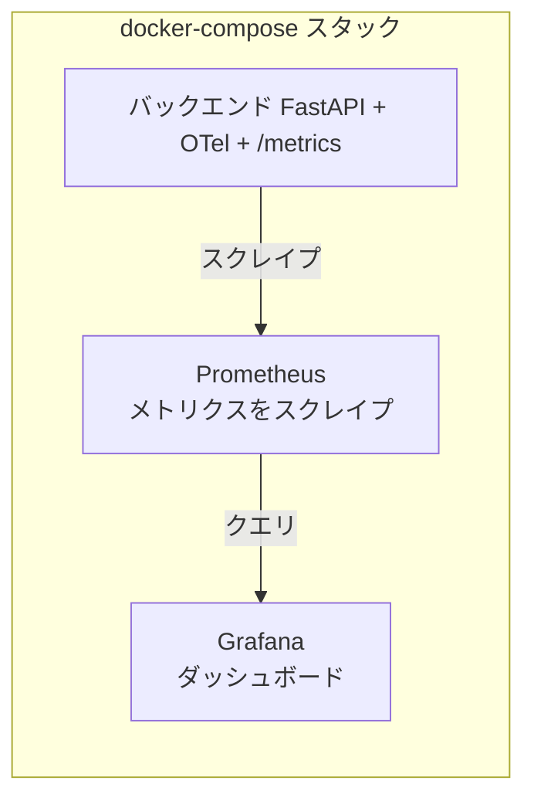
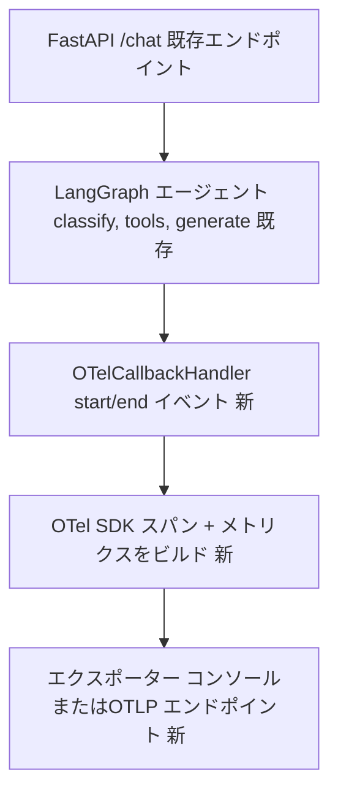

## コンテキスト

バックエンドはFastAPIアプリ（`backend/api/main.py`）で、すべての`POST /chat`呼び出しで、コンパイル済みのLangGraphエージェント（`backend/agent/graph.py`）を実行します。現在のところ、エージェントにはトレーシングがなく、メトリクスもなく、`/metrics`エンドポイントも構造化ログもなく、唯一の可視性は構造化されていない標準出力だけです。`docs/plan.md`ではStep 8の範囲を以下のように定義しています：OTelのFastAPI + LangGraphのインストルメンテーション、Prometheusのスクレイピング、Grafanaダッシュボード、CloudWatchのログ集約、および4つの名前付きメトリクス（`/chat`レイテンシのパーセンタイル、インテント分布、LLM呼び出し時間、RAG検索率）。

これは同じ設計の2回目のパスです。最初のパスではSDKの配線とcomposeサービスのスキャフォルディングは行いましたが、`docs/plan.md`のScope を改めて確認したところ、本当の問題であると判明した3つの点が未解決のままでした。これらはニーズではなく、解決する必要がある事項です：(1) OTel `Resource`属性がないため、複数インスタンスやサービスが存在すると、すべてのスパン/メトリクスが追跡不可能になる。(2) 遅いトレースとそれに対応するログ行を相関させる方法がない。(3) CloudWatchは完全に「Step 9、スコープ外」に落とされていたが、AWS依存のない部分（構造化JSON ログの発行）は今すぐ実装すべきでした。このデザインではこれらを組み込みます。

この変更は明示的に分担作業です（提案を参照）。Claude Codeはcomposeサービスとその他の複雑な設定を処理し、ユーザーはメトリクス定義、スパン名/属性、ダッシュボード、およびパイプラインが実際にデータを表示することを確認します。このデザインドキュメントは、スキャフォルディングされた部分のみをカバーしています。

## 概要図

バックエンドは`/metrics`を公開し、Prometheusは一定間隔でスクレイプし、Grafanaはprometheusをクエリします。これはDecision 6/7に該当します。

ラベルのないノードは、この変更の影響を受けない既存のアプリケーションコードです。コールバックハンドラー、OTel SDK、およびエクスポーターノードは、この変更によって追加される部分です（Decision 4に対応）。LLM呼び出しレベルの入れ子スパン（Migration Plan step 4 / tasks.md 4.4）は、確認がまだ保留中で確定していないため、ここでは別途表示されていません。

## ゴール / 非ゴール

**ゴール：**
- Prometheus + Grafanaをdocker-composeサービスとして稼働させ、バックエンドと相互に到達可能にし、**再起動後もデータが保持される**（名前付きボリューム）ようにします。これにより、`docker-compose up`後の空のダッシュボードは「まだメトリクスが記録されていない」ことを確実に意味し、「再起動で失われた」ことではありません。
- OpenTelemetry SDKを`backend/api/main.py`に配線して、`MeterProvider`/`TracerProvider`が存在し、サービスを識別するための`Resource`でタグ付けされます（`service.name=travel-agent-backend`、`service.version`はFastAPIアプリの既存の`version="0.1.0"`から読み込まれ、`deployment.environment`は環境変数からデフォルトは`local`）、および`FastAPIInstrumentor`が自動的にHTTPリクエストスパンをインストルメント化します。
- トレースエクスポーター宛先を設定可能にし（環境変数）、デフォルトはコンソールとし、後で実際のトレースバックエンドを配線することは、コード変更ではなく設定変更となるようにします。
- `prometheus-client`のASGIアプリ（またはOTel Prometheusエクスポーターリーダー）経由でバックエンドに`/metrics`エンドポイントを公開し、Prometheusがスクレイプする対象を持つようにします。
- `BaseCallbackHandler`を使用してLangGraphノード実行のスパンインストルメンテーション（およびそれらのノード内のLLM/ツール呼び出し）を提供し、グラフ呼び出し時に一度登録されます。これにより、ユーザーのためのスパン名/属性を決定したり、`backend/agent/graph.py`または`backend/agent/nodes.py`への変更を要求することなく行われます。
- 4つの主要メトリクスのインストルメント・オブジェクトを宣言し（実装ではなく）、名前付きプレースホルダーとして機能させることで、ユーザーが開始地点と、埋めるべき一貫した場所を持つようにします。
- アクティブな`trace_id`/`span_id`が注入された構造化（JSON）リクエスト/レスポンスログを追加して、すべてのログレコードにIDが含まれるようにします。これにより、コンソールエクスポーター（またはまたGrafana/Tempo）で遅いスパンを見つめているユーザーが、そのIDをログにgrep できるようにします。
- 新しいインストルメンテーションコードパスを直接実行するテストを追加します。既存のテストが単に通過することではなく、テストされていないスキャフォルディングはまさに、ユーザー自身のメトリクス記録作業が後で責任を負うようなサイレント障害を引き起こします。
- `docs/step8.md`のドラフトを作成し、スタックの「何」と「なぜ」を説明し、ユーザーが所有する部分に対して明示的な「TODO (you)」マーカーを残し、検討された代替案としてLangSmithに言及します。

**非ゴール：**
- 最終的なメトリクス名、ラベルセット、ヒストグラムバケット、またはカーディナリティを決定する。ユーザーの判断です。低カーディナリティラベル設計は学習目標そのものです。
- 実際のGrafanaダッシュボードを構築（JSONモデル、パネル、クエリ）します。スキャフォルディングはデータソースのみを提供し、ダッシュボードは提供しません。
- 実際のCloudWatchログ*出荷*（ロググループの作成、IAMロール、`awslogs`ドライバーまたはFireLessの設定）。これはまだAWS固有で、Step 9に属します。AWSアカウント/ロググループを対象にする必要があるからです。スコープに含まれるのは、ログ自体を構造化JSON にすることです。そうすることで、出荷ステップは後で単なる配管になります。
- エージェント動作、ルーティング、または既存のテストを変更します。インストルメンテーションは副作用のみである必要があります。コールバックハンドラーはグラフ/LLM/ツールイベントを観察しますが、状態フローを変更することはなく、`backend/agent/graph.py`/`backend/agent/nodes.py`は変更されません。
- Gemini/LangChainクライアント呼び出しを専用ライブラリで自動インストルメント化したり、LangSmithを配線したりします。`OTelCallbackHandler`はすでに`on_llm_start`/`on_llm_end`イベントを受け取ります（生成応答/分類意図内のLLM呼び出し用。Migration Plan step 4の検証待ち。追加配線なしでコールバック伝播がその入れ子呼び出しに到達するかどうか。以下のフィックス#2を参照）。LangSmithは`docs/step8.md`で、この変更が採用するものではなく、ユーザー自身の評価に値する代替案として示されています。（観測バックエンドを変更するだけで、スキャフォルディングではなく、`docs/plan.md`は明確にOTel/Prometheus/Grafanaスタックを指名しています）。
- アラート設定またはSLOバーンレートルール（Prometheus AlertManager、Grafanaアラート）。`docs/plan.md`のStep 8スコープには記載されていません。ダッシュボードが存在した後の未解決の問題として記載されています。

## 決定事項

**1. プッシュ/OTLPコレクターではなくPrometheusプルモデル。** バックエンドは`/metrics`を直接公開し（`prometheus-client`の`make_asgi_app()`をFastAPIにマウント、またはOpenTelemetryエクスポーター-prometheusのリーダー経由）、Prometheusは一定間隔でスクレイプします。検討された代替案：OTelコレクターをサイドカーとして実行し、OTLPプッシュを受け取りPrometheusに再エクスポートする。スキャフォルディング用に却下されました。スキャフォルディング用に却下されました。コレクターを追加し、ユーザーが1つのメトリクスを表示する前にデバッグする必要がある設定サーフェス（コレクターパイプラインYAML）を追加するためです。プルベースのスクレイピングには移動部分が少なく、最初のエンドツーエンドのパスではより簡潔です。コレクターは、トレースが実際のOTLPバックエンドを必要とする場合の後続の改善として理にかなっており、下記の設定可能エクスポーターの決定がこれを開いたままにしています。

**2. トレースエクスポーターの宛先は`OTEL_EXPORTER_OTLP_ENDPOINT`で設定可能で、未設定時はコンソールがデフォルト。** 最初のドラフトではコンソール専用エクスポーターをハードコードし、スワップインのパスがなく、「実際のトレースバックエンドを追加」すると`main.py`を再度編集する必要がありました。代わりに、SDKセットアップはその環境変数をチェックします：設定されている場合は`OTLPSpanExporter`を指し示して使用します。未設定の場合は`ConsoleSpanExporter`にフォールバックします。検討された代替案：コンソール専用でハードコードし、「トレースバックエンドを追加」を後で対処する問題として扱う。これは却下されました。今すぐ設定可能にするコストは数行の代わりに、後で別の提案/設計サイクルだけが何の理由もなくハードコードされていたものをパラメータ化するために必要です。

**3. OTel `Resource`属性はプロバイダーの構築時に設定され、暗黙のままにされません。** `service.name`、`service.version`（FastAPIアプリの既存の`version="0.1.0"`から再利用）、および`deployment.environment`（環境変数、デフォルト`local`）は、`TracerProvider`と`MeterProvider`の両方に接続されています。検討された代替案：リソース属性をスキップします。今日はサービスは1つだけですから。これは却下されました。(a) 今追加するのはほぼ無料ですし、(b) リソース属性なしで発行されるすべてのスパン/メトリクスは、2番目のサービスまたは環境（staging対local）が存在すると、Prometheus/Grafanaで永遠に追跡不可能であり、ダッシュボードが構築された後にリソース属性をレトロフィットするには、ラベルの仮定を再度行う必要があります。

**4. グラフビルド時に適用されたラッパーではなく、グラフ呼び出し時に登録された`BaseCallbackHandler`経由のスパン/メトリクスインストルメンテーション。** LangGraphノードはすでに`on_chain_start`/`on_chain_end`イベント（および`on_llm_start`/`on_llm_end`、LangChain Runnableとして呼び出されるもののための`on_tool_start`/`on_tool_end`）を標準的なLangChainコールバックシステムを介して発行します。単一の`OTelCallbackHandler(BaseCallbackHandler)`は`backend/observability/callback_handler.py`でこれらのイベントをOTelスパンに変換します。グラフが`backend/api/main.py`で呼び出されるときに`config={"callbacks": [OTelCallbackHandler()]}`経由で1回登録されます。`backend/agent/graph.py`は変更を必要とします。`backend/agent/nodes.py`は*必要とされない*ことが期待されます。`config`はすべての入れ子Runnable呼び出しに自動的に伝播する必要があるため、`generate_response`/`classify_intent`内の`get_model().invoke(prompt)`に到達します。これは期待される結果であり、確定した事実ではなく、Migration Plan step 4 / tasks.md 4.4で明確に確認されます。伝播が`generate_response`/`classify_intent`内の`get_model().invoke(prompt)`に到達しないことが判明した場合、フォールバックはこれら2つのノード署名に`config: RunnableConfig`を追加し、明示的に転送すること。`nodes.py`への「変更なし」の小さな、文書化された例外で、全体的なアプローチへの変更ではありません。検討された代替案：(a) `nodes.py`内の各ノード関数を直接デコレートする。これは前述と同じように却下されました。ビジネスロジック全体にOTelインポートを散在させます。(b) `build_graph()`の`add_node()`時に適用されたカスタムラッパー（前のドラフトのアプローチ）。これは却下されました。すべての`add_node()`呼び出しでラッピングを覚える必要があり、ノード粒度でのみ発火します（`classify_intent`/`generate_response`内のLLM呼び出しの自動入れ子スパンなし。これは`docs/plan.md`の4つの名前付きメトリクスの1つです）。LangSmithと合成されません。LangSmithは別のオープンな質問のため、同じ`callbacks`リストに両方を登録できるため、ユーザーが後で並行比較したい場合はLangSmith も`BaseCallbackHandler`です。トレードオフ：LangChainToolラッパーを経由せずに生のPython/HTTPを呼び出すノード（例えば、`weather_server.py`がOpen-Meteoにアクセスする場合）は、カプセル化ノードレベルのスパンのみが自動的に取得されます。ノード内の粒度は、これらの特定の呼び出しについて、同じ制限の手動インストルメンテーションのままです。前のアプローチのように。

**5. 新しいロギングフレームワークではなく、ルートロガーの`logging.Filter`経由のスパン/スパンID注入を使用した構造化JSONログ。** 小さい`backend/observability/logging.py`は、Pythonの標準ライブラリ`logging`をJSONフォーマッターとフィルターで設定し、フィルターは現在のOTelスパンコンテキスト（`trace.get_current_span().get_span_context()`）を読み取り、`trace_id`/`span_id`を各`LogRecord`に接続します。検討された代替案：`structlog`または他のサードパーティロギングライブラリを全体的に採用します。この提案は不要な表面積として却下されました。標準ライブラリ`logging`に1つのフォーマッターと1つのフィルターを加えると、この変更の他のすべてを学ぶようにユーザーに要求することなく相関が機能します。

**6. 新しいcomposeサービス（`prometheus`、`grafana`）を`docker-compose.yaml`に直接追加します。各サービスには名前付きボリュームとヘルスチェックがあり、別の観測可能性composeファイルではありません。** 既存の`docker-compose.yaml`は小さい（2サービス）で、現在composeファイルを懸念で分割していません。`observability/`ディレクトリを設定ファイル（prometheus.yml、grafanaプロビジョニング）に追加しますが、1つのcomposeファイルを保持することは、現在のフラット構造と一致します。名前付きボリューム（`prometheus_data`、`grafana_data`）は、既存の`chroma_data`ボリュームと同じパターンに従います。ヘルスチェックは既存の`backend`サービスのパターン（各サービス自体の準備エンドポイントに対する`curl -f`）を反映しているため、`docker-compose ps`は、デバッグ中に「コンテナー実行中」が「サービスはまだブート中」をマスクする代わりに、正直なシグナルを提供します。

**7. Grafanaプロビジョニングはプロメテウスデータソースのみを配線します。ダッシュボードはプロビジョニングされません。** ダッシュボードフォルダーが作成されます（`observability/grafana/dashboards/`）が、プレースホルダーREADME を除いて空のままになります。ダッシュボードの構築は提案によるとユーザーの実習タスクであるため、ダッシュボードを作成することは明示的にユーザーの実習課題です。

**8. 新しいテストは既存のバックエンドテストと同じ場所に配置されたインストルメンテーションコードを直接ターゲットにします。** `backend/tests/test_observability.py`は、`/metrics`が200を返すことと、4つの宣言されたインストルメント名が含まれていることをアサートします。また、`OTelCallbackHandler`がスパンを終了し、`on_chain_error`（または`on_llm_error`/`on_tool_error`）が発火したときに元の例外を伝播させ、実際のグラフ実行を必要とせずに行われることをアサートします。検討された代替案：「既存のテストが依然として通過する」ことをバーとして依存することのみ。これは却下されました。そのバーは既存の動作の回帰をキャッチするだけです。新しいスキャフォルディング自体が機能するかどうかについて何も言いません。これはまさにユーザーが構築する予定のコードです。

## リスク / トレードオフ

- [デフォルトではトレースバックエンドがなく、スパンはコンソール出力を通じてのみ表示されます。これはノイズが多く、見落としやすい] → `docs/step8.md`は、デバッグ中にスパン出力を目視する方法に関する明示的な指示でこれを呼び出し、`OTEL_EXPORTER_OTLP_ENDPOINT`を単一変数のパス、実際のバックエンド（Jaeger/Tempo）へのパスとして文書化します。ユーザーがコンソール出力ではなくトレース視覚化を必要とする場合。
- [プレースホルダーメトリクスインストルメントに配線された記録呼び出しがなく、ユーザーが埋めるまで「デッドコード」である可能性があります。機能が壊れているように見える可能性があります] → `docs/step8.md`とコードコメントはこれらを明確に`# TODO: bucket境界を定義してこのメトリクスを記録する`としてマークしているため、ユーザーがその作業を完了するまでGrafanaにデータが表示されないことは明白です。これは意図的であり、提案に基づいており、バグではありません。
- [Prometheus/Grafana用の名前付きボリュームを追加することは、`docker-compose down`/`up`サイクル間で古いデータが永続する可能性があり、それ自体がデバッグを混乱させる可能性があります（「なぜ古いデータが見えるのか」）] → `docs/step8.md`は、`docker-compose down -v`を観測可能性状態をリセットするための明示的な方法として文書化し、平原の再起動とは異なります。
- [`prometheus-client`/OTelエクスポーターパッケージとJSON ログフォーマッターは、すでに存在しているが未使用の`opentelemetry-api`/`sdk`パッケージの隣に新しいランタイム依存関係です] → `backend/requirements.txt`のバージョンをピンしてください。既存の`opentelemetry-*==1.43.0`ピンとの一貫性を保ち、起動時のバージョン不一致のインポートエラーを回避します。
- [ノードが発生した場合のみ`on_chain_start`/`on_chain_end`を実装する`BaseCallbackHandler`は、エラーで発生した場合、`on_chain_end`が発火しないためスパンが開いたままになります。] → `OTelCallbackHandler`は、失敗のエンドスパンを終了するために`on_chain_error`/`on_llm_error`/`on_tool_error`も実装します。LangChainは、`_start`あたりの`_end`/`_error`コールバックのうち正確に1つが発火することを保証し、ハンドラーは決して例外に触れません（手動の`try/finally`ラッパーと同じ再スロー ロジックは必要ありません）。新しい`test_observability.py`によって直接カバーされます。
- [すべてのログレコードにトレース/スパンIDを注入すると、小さいログレコード毎のオーバーヘッドが追加され、OTelコンテキストがアクティブである依存性が発生します] → フィルターは適切に低下します（アクティブなスパンの外で呼び出された場合、例えば最初のリクエストの前のスタートアップログで`trace_id: None` / `span_id: None`を発行します）。
- [`prometheus`/`grafana`サービスを追加すると、観測可能性を必要としないローカルでアプリを実行しているだけの人にとって`docker-compose up`が遅くなり、より重くなります] → 両方のサービスは追加的であり、`backend`/`frontend`のスタートアップをブロックしません（`backend` → `prometheus`からの`depends_on`なし）。ユーザーは依然として`docker-compose up backend frontend`を実行できます。

## マイグレーション計画

1. `backend/requirements.txt`にOTel + Prometheusクライアント + JSONログ依存関係を追加し、venv内で`pip install -r requirements.txt`を実行します。
2. SDKセットアップ（`Resource`属性と設定可能なエクスポーター付き）と構造化ログ配線を`backend/api/main.py`に追加します。`backend/observability/callback_handler.py`を`OTelCallbackHandler`定義に追加し、`backend/api/main.py`の`graph.ainvoke(...)`呼び出しで`config={"callbacks": [...]}`経由で登録します。`backend/agent/graph.py`は変更されません。`pytest tests/ -v`が依然として通過することを確認します。新しい`test_observability.py`を含みます。これは既存の`patch("api.main.graph")`テストポイントを中断しないでください。コールバックハンドラーはグラフ自体にベイク됴されずに呼び出し設定として渡されるため、グラフ自体にはベイク されません。
3. `prometheus`/`grafana`サービス + ボリューム + ヘルスチェック + `observability/prometheus.yml` + Grafanaデータソースプロビジョニングを`docker-compose.yaml`に追加します。
4. `docker-compose up --build`を実行し、`prometheus`コンテナーから`/metrics`に到達可能であること、Prometheusがバックエンドターゲットを`UP`として表示すること、再起動（`docker-compose restart prometheus grafana`。`down -v`ではなく）が以前のスクレイプ履歴を保持することを確認します。これは、ユーザーが実際のメトリクス定義を開始する前の最初の「スキャフォルディングが機能するのか」チェックポイントです。入れ子のLLM呼び出しスパンが`generate_response`/`classify_intent`のノードレベルスパンの下に実際に表示されることを確認します（実際の`/chat`リクエスト中にコンソールエクスポーター出力をチェック）。`on_llm_start`/`on_llm_end`が自動的に発火**しない**場合は、`config: RunnableConfig`をそれら2つのノード関数の`backend/agent/nodes.py`のパラメーターとして追加し、`get_model().invoke(prompt, config=config)`に明示的に転送します。入れ子スパンを取得するために必要な最小変更であり、必要な場合、「`nodes.py`への変更なし」の唯一の例外です。どちらの結果が発生した場合でも、`docs/step8.md`で文書化します。楽観的なケースを想定するのではなく。
5. ロールバック：すべての変更は追加的です（新しいサービス、新しい依存関係、新しいエンドポイント、新しいログフォーマッター）。戻すことは、スキャフォルディング・コミットの`git revert`です。唯一のステートフルアーティファクトは、新しい名前付きDockerボリュームであり、`docker-compose down -v`はマイグレーションの問題なく清潔に削除します。

## オープンな質問

- トレースは結果的に実際のバックエンド（Jaeger/Tempo/Grafana Cloud）に移動する必要があり、`OTEL_EXPORTER_OTLP_ENDPOINT`は十分か、またはコレクターサイドカーパターンは複数のサービスが存在する場合に価値があるのか？スコープ内のPrometheusシェイプメトリクスには必須ではないため、未決です。
- LangSmith（LangChainを介して推移的にすでにインストール済み）は、`OTelCallbackHandler`の代わりに、またはLangGraph固有のトレーシング用に採用する価値があるか？これはLangGraphネイティブ（ノードあたり、LLM呼び出し毎の内訳。最小限のセットアップ。`LANGCHAIN_TRACING_V2=true`経由）、そして`OTelCallbackHandler`と同じく`BaseCallbackHandler`であるため、実装パイプラインの所有権か、選択肢の選択肢ではなく、並行比較のために同じ`callbacks`リストに登録できます。ただし、`docs/plan.md`が指名するPrometheus/Grafanaスタックとは別のSaaS製品があり、トレースを見る場所を2つの場所で意味します。`docs/step8.md`で、この変更が採用するものではなく、ユーザーが評価する代替案として示されています。
- Gemini/LLM呼び出し時間メトリクスは、`OTelCallbackHandler`が受け取る`on_llm_start`/`on_llm_end`イベント（LangChain チャットモデルを返す`get_model()`を自動的にカプセル化ノードスパン内で実行された入れ子スパンを与える。カプセル化ノードスパン内で実行されたRunnable）として記録されるか、またはユーザーより粗いノードレベル期間の方が望ましいか？これは、Migration Plan step 4 / tasks.md 4.4チェックが、追加配線なしでそれらのイベントが実際に発火することを確認することを前提としています。発火しないことが判明した場合、`config`転送フォールバックが必要ですが、細粒度サブスパンはまだ利用可能になります。`nodes.py`で1行の明示的ではなく、無料で。ユーザーのメトリクス設計パスでは、ヒストグラムが実際に記録すべきどの1つの問題かを決定するために残されています。
- 完全なCloudWatch出荷はStep 9に延期されています。そのステップでは、k8sマニフェスト/ECSタスク定義のスタブログドライバー設定が今必要か、または構造化JSON出力（ここで行われた）が十分な準備か？現在、Step 9に完全に延期されています。
